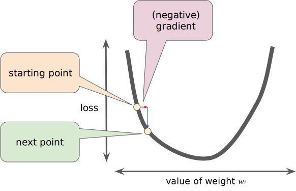

# Building a Neural Network From Scratch with NumPy
Matt Hodges
2022-08-06

This post is adapted from a Jupyter [Notebook found on
GitHub](https://github.com/hodgesmr/neural_network_from_scratch).

The goal of this post is to give a hands-on explanation of how
Artificial Neural Networks work. I intentionally avoided frameworks like
PyTorch or Tensoflow because I wanted to build a better understanding of
what Machine Learning models actually are, what Neural Networks actually
are, and how they can be made. This post is a collection of information
I wish I had when I began this journey. It touches on a little bit of
the math, but I don’t deeply re-explain the math. I try to link out to
more explanatory sources where I think it’s valuable. Note: I am not a
Machine Learning engineer, nor am I a Data Scientist. I’m a Software
Engineer that turned into a political operative (lol). I wrote this for
an audience of Software Engineers. Also: I don’t have a GPU and I don’t
want to spend a bunch of money renting one from Amazon. This model can
be trained and deployed on a modern CPU in a matter of minutes.

### What We’ll Be Doing

We’re going to build a Neural Network for multi-class classification.
All that means is we’re going to make a model takes in images and
attempts to label them from a set of options. In our case, we’re going
to create a Neural Network that works with the [MNIST database of
handwritten digits](https://yann.lecun.com/exdb/mnist/). This database
contains 70,000 images of handwritten digits, 0 - 9, and corresponding
labels of which digit the handwritten image is. We’ll use 60,000 of the
images to train our Neural Network, and 10,000 to test its accuracy. The
rest of this post assumes you have the data downloaded to a local
`data/` directory.

Neural Networks are particularly handy for image classification tasks.
There are many other types of Machine Learning out there, but we won’t
spend any attention on those.

### Background Concepts

#### Shape of a Neural Network

First of all, let’s demystify one thing: Neural Networks are just
graphs. Just nodes and edges. If you’ve studied any Computer Science or
have a background in Software Engineering, this is probably a familiar
conecpet to you. The exact shape of any given Neural Network is
dependant on how you build it, but that’s something we get to decide.
The graph has an **input layer** that is usually one node per input
feature. In our case, **a pixel of an image is a feature**. Next, there
are one or more **hidden layers**. Hidden layers are simply nodes in the
graph that are in the middle. They take inputs from other nodes, and the
give outputs to other nodes. This is the part that makes it Deep
Learning. The presence of one or more hidden layers is the “deep” in
Deep Learning. There’s no standard rule for the size of a hidden layer,
or how many you should have. Finally, there’s an **output layer**. Each
node in the output layer corresponds to one label. For example, if a
possible label to an image is “cat” then one node in the output layer
represents “cat”. We’re going to make a Neural Network that has a bunch
of input layer nodes, a single hidden layer with ten nodes, and an
output layer with ten nodes, one for each digit 0 - 9.

Each Nueron (node) has a unique **Weight** and **Bias**, and each layer
has an **Activation Function**. The Activation Function defines the
output of a neuron given its inputs, and does not change. We’ll talk
more about Activation Functions below. As we train our model, we adjust
the Weights and Biases.

Here’s are drawing of a Neural Network with three input nodes, a hidden
layer with four nodes, and an output layer with two nodes. This might be
how you’d construct a Neural Network that does binary classification: a
model that tries to label inputs to one of two options for outputs.

|  |
|:--:|
| en:User:Cburnett, [CC BY-SA 3.0](http://creativecommons.org/licenses/by-sa/3.0/), via Wikimedia Commons |

If you’re looking for more explanation of the structure of Neural
Networks, “[But what is a Neural
Network?](https://www.3blue1brown.com/lessons/neural-networks)” by
3Blue1Brown is excellent.

#### How the Neural Network Learns

Neural Networks start out very stupid. As we’ll see, they begin with no
more “intelligence” than random guessing. Our goal is to **iteratively
adjust the network’s Weights and Biases** to make it smarter. This is
called **training** and we do it in two steps: **Forward Propagation**
and **Back Propagation**.

##### Forward Propagation

Think of this step as showing the Neural Network some input, and asking
it to classify it. At the beginning, it’s very likely to get it wrong.
But, like humans, we need to get things wrong before we know how to get
them right. In Forward Propagation, we simply push all our features
(pixels) through the Neural Network and ask, “what did you see?” The
output is all the answers to that question.

##### Back Propagation

Think of this step as showing the Neural Network how right or wrong its
answers were. We take all its answers to, “what did you see?” and come
up with a measure of how wrong it was. We assign a numeric value to the
“how wrong was it?” question with a [cost
function](https://www.simplilearn.com/tutorials/machine-learning-tutorial/cost-function-in-machine-learning).
From that numerica value, we can work backwards on all the neurons
(nodes) to tell them, “you were X wrong, and this specific neuron
contributed to Y amount of that error; adjust this neuron’s Weights and
Biases by Z amount and try again.”

3Blue1Brown has another excellent video on the conecepts of Back
Propagation: “[What is backpropagation really
doing?](https://www.3blue1brown.com/lessons/backpropagation)” It’s got
some great visuals to show how Forward Propagation pushes data forward
through the Neural Network, and how Back Propagation pushes error
measures backwards thrrough the Neural Network.

##### Training

And that’s it! Our Neural Network learns by repeatedly making guesses,
seeing how wrong it was, and adjusting its Weights and Biases. We repeat
this over and over until it is good at the task! This is a lot like how
people learn. Show a small child pictures of various farm animals over
and over and ask them to name the animals. At first they’re very bad at
it, but over time they get very good at it. There’s a lot of research
out there that our artifical Neural Network is structured and operates
like human brain neurons.

#### Gradient Descent

Gradient Descent is the most math-y piece of all this. Again,
3Blue1Brown has a great video: “[Gradient descent, how neural networks
learn](https://www.3blue1brown.com/lessons/gradient-descent)”. This is
the piece that is the most *choose-your-own-adventure* for how much you
want to actually understand. I recommend diving in at least a little
bit.

Imagine being at a point graph and you want to find which step to take
to get to the minimum value. If you’ve taken any calculus before, you
know that you can take the slope at the current point to tell you which
way the graph is trending, and by how much. If you do this over and
over, with small steps, you will approach a local minimum. That’s a
1-dimensional gradient descent. Our plan is to work with lots of
repeated steps to get to a minumum of our [cost
function](https://www.simplilearn.com/tutorials/machine-learning-tutorial/cost-function-in-machine-learning)
— the function telling us how bad our predictions are.

|  |
|:--:|
| Reducing Loss: Gradient Descent, [CC BY 4.0](https://creativecommons.org/licenses/by/4.0/), via [Google Developers](https://developers.google.com/machine-learning/crash-course/reducing-loss/gradient-descent) |

You can do this in two and three domensions as well. In fact, you can do
it in as many dimensions as you need, which is very handy, because image
classification has lots of dimensions. Imagine a color image. Its
obvious dimensions are the pixel’s X value, Y value, Red value, Green
value, Blue value, alpha value, and probably many more.

Quick aside: **a “tensor” is just a matrix with a high-order of
dimensions**.

|  |
|:--:|
| [CC0 1.0 Universal (CC0 1.0) Public Domain Dedication](https://creativecommons.org/publicdomain/zero/1.0/deed.en), via Wikimedia Commons |

Ultimately, we keep moving downward in our many-dimensional cost
function to find a minimum value. The lower the cost, the better the
prediction.

### Environment Setup

As stated, we’re going to build and train a fully functioning Neural
Network using only **NumPy**. That said, I’m also going to install
**matplotlib** just so that we can visualize some of the work as we go.
It’s completely unnecessary to use matplotlib.

It’s also worth pointing out that I’m developing this in Python 3.10.
Other versions of Python 3 probably work, too.

``` python
import matplotlib.pyplot as plt
import numpy as np
```

### Our Data

As mentioned, we’re going to be working with the MNIST database of
handwritten digits. This is a very handy beginner’s data set because
it’s done a lot of the upfront work for us. First of all, the data is
normalized: **all images are 28 x 28** and **grayscale**. The standard
size is particularly helpful because we’re going to need that to set up
the input layer of our Neural Network. In other situations, you’d have
to crop or squash or letterbox your images to make them a standard size.
This is mostly boilerplate, but some details of the file format that you
may wish to know:

- The images are encoded in the [IDX file
  format](https://www.fon.hum.uva.nl/praat/manual/IDX_file_format.html),
  which looks for the presence of some magic numbers
- There’s a [documented structure](http://yann.lecun.com/exdb/mnist/) to
  this data set, but that website is often behind HTTP basic auth
  because people like to script against it; here’s a [Google
  cache](https://webcache.googleusercontent.com/search?q=cache:yann.lecun.com/exdb/mnist/)
- The images are gzip’d
- The pixel values are 0 - 255, but we’re going to divide them into
  floats 0 - 1

Here, we read in all the training data. We want to structure it into a
matrix where each pixel is a row (this will line up with our input
layer), and each image is a column. This gives us a matrix with 784 rows
(28 x 28) and 60,000 columns.

This is the least intersting bit of code in the entire post.

``` python
import gzip

DATA_DIR = './data/'
TEST_IMAGE_FILE_PATH = f'{DATA_DIR}/t10k-images-idx3-ubyte.gz'
TEST_LABEL_FILE_PATH = f'{DATA_DIR}/t10k-labels-idx1-ubyte.gz'
TRAINING_IMAGE_FILE_PATH = f'{DATA_DIR}/train-images-idx3-ubyte.gz'
TRAINING_LABEL_FILE_PATH = f'{DATA_DIR}/train-labels-idx1-ubyte.gz'

def load_images_and_labels(image_file_path, label_file_path):
    labels = None
    image_data = None

    with gzip.open(label_file_path, 'r') as label_file:
        # Verify magic number
        magic_number_bytes = label_file.read(4)
        magic_number = int.from_bytes(magic_number_bytes, byteorder='big', signed=False)
        assert magic_number == 2049

        # Read header telling us the number of labels
        number_of_labels_bytes = label_file.read(4)
        number_of_labels = int.from_bytes(
            number_of_labels_bytes, byteorder='big', signed=False
        )

        buffer = label_file.read(number_of_labels)
        labels = np.frombuffer(buffer, dtype=np.uint8)

        with gzip.open(image_file_path, 'r') as image_file:
            # Verify magic number
            magic_number_bytes = image_file.read(4)
            magic_number = int.from_bytes(
                magic_number_bytes, byteorder='big', signed=False
            )
            assert magic_number == 2051

            # Read header telling us the number of images
            # And check that it matches the number of labels
            number_of_images_bytes = image_file.read(4)
            number_of_images = int.from_bytes(
                number_of_images_bytes, byteorder='big', signed=False
            )
            assert number_of_images == number_of_labels

            # Read the image height header
            image_height_bytes = image_file.read(4)
            image_height = int.from_bytes(
                image_height_bytes, byteorder='big', signed=False
            )

            # Read the image width header
            image_width_bytes = image_file.read(4)
            image_width = int.from_bytes(
                image_width_bytes, byteorder='big', signed=False
            )

            # read in the image data
            buffer = image_file.read(image_width * image_height * number_of_images)
            image_data = np.frombuffer(buffer, dtype=np.uint8).astype(np.float64) / 255

            # Reshape it to a matrix such that each column is the pixels of the image
            # So, we end up with a matrix with `image_width*image_height` rows and `number_of_images` colums
            image_data = image_data.reshape(
                number_of_images, image_width * image_height
            ).T

    return image_data, labels
```

And show the first image and label:

``` python
training_image_data, training_labels = load_images_and_labels(TRAINING_IMAGE_FILE_PATH, TRAINING_LABEL_FILE_PATH)
first_image_data = training_image_data[:, 0].reshape((28, 28))  # All the rows in the first column, reshaped back to 28 x 28
first_image_label = training_labels[0]

print(f'Label: {first_image_label}')
plt.imshow(first_image_data, cmap='gray_r', vmin=0, vmax=1)
plt.show()
```

    Label: 5


### An Untrained Neural Network

#### Initializing Weights and Biases

The first step in creating our Neural Network is to build out Forward
Propagation. Since our Neural Network will have an input layer, one
hidden layer, and an output layer, we’ll need:

- A set of Weights and Biases on the input layer
- An Activation Function on the input layer
- A set of Weights and Biases on the hidden layer
- An Activation Function on the hidden layer

As mentioned, the Weights and Biases are variable and are determined in
the model’s training process. But our model needs to start somewhere.
There are a variety of strategies for initializing Weights and Biases.
You could initialize to random values, but we’re going to use the [He
method](https://towardsdatascience.com/coding-neural-network-parameters-initialization-f7c2d770e874)
to initialize random Weights, and the [common recommendation of Biases
initialized to zero](https://cs231n.github.io/neural-networks-2/).

``` python
# weights_1 is the matrix of Weights between our input nodes and the first hidden layer
# it has the shape num_labels x image_size
#
# biases_1 is the matrix of Biases between our input nodes and the first hidden layer
# it has the shape num_labels x 1
#
# weights_2 is the matrix of Weights between our hidden layer and our output layer
# it has the shape num_labels x num_labels
#
# biases_2 is the matrix of biases between our hidden layer and our output layer
# it has the shape num_labels x 1
def init_params(input_layer_size, hidden_layer_size, output_layer_size):
    weights_1 = np.random.randn(
        hidden_layer_size,
        input_layer_size,
    ) * np.sqrt(2 / input_layer_size)
    
    weights_2 = np.random.randn(
        hidden_layer_size,
        output_layer_size,
    ) * np.sqrt(2 / hidden_layer_size)

    biases_1 = np.zeros((hidden_layer_size, 1))
    biases_2 = np.zeros((output_layer_size, 1))

    return weights_1, biases_1, weights_2, biases_2
```

#### Input Layer Activation Function

Next we need to select an activation function on our input layer. Common
options are [sigmoid](https://en.wikipedia.org/wiki/Sigmoid_function)
and
[ReLU](https://en.wikipedia.org/wiki/Rectifier_%28neural_networks%29).
ReLU is very effective and is a very common choice in computer vision
models. Also, it’s incredibly simple to implement, so we’ll go with
that.

All it does is take a value as input, and if the value is less than 0,
return 0; if the value is greater than 0, return that value. That’s it!
[Here’s a handy post comparing ReLU to other activation
functions](https://www.aitude.com/comparison-of-sigmoid-tanh-and-relu-activation-functions/).

``` python
def relu(value):
    return np.maximum(value, 0)
```

#### Hidden Layer Activation Function

The last piece we need for our Forward Propagation is an Activation
Function on the hidden layer. Remember: this Activation Function is
feeding to our output layer, so we need something that generates ten
prediction values. A good way to do this is to take our unactivated
hidden layer and normalize it such that it outputs “prediction odds” to
our output layer. Put another way, if the model is 91% sure an input is
the number 5, it should activate the 5’s output node to 0.91, and the
sum of all the other predictions should come to 0.09.

What we’ve just described is called the [Softmax
function](https://en.wikipedia.org/wiki/Softmax_function). The mast
might look a little strange ([here’s a good
explainer](https://towardsdatascience.com/softmax-activation-function-explained-a7e1bc3ad60)),
but all it’s doing is taking in a set of numbers and normalizing them to
be 0 - 1, with a sum of 1.

``` python
def softmax(inputs):
    exponentiated = np.exp(inputs)
    probabilities = exponentiated / np.sum(exponentiated, axis=0)
    return probabilities
```

#### Forward Propagation

We can now combine our initialized Weights and Biases and our Activation
Functions to define Forward Propagation. You’ll notice some matrix math
in here. Since our features (pixels) are arranged in a matrix, this is
much more efficient that piping every pixel through functions one at a
time. This becomes particularly true when you’re working with Neural
Networks of higher dimensions. [Here’s a refresher on matrix dot
product](https://www.youtube.com/watch?v=87_7YVCnAOw). But you can
basically think of it as multiplying the neurons in a layer by their
weights.

``` python
def forward_prop(weights_1, biases_1, weights_2, biases_2, input_layer):
    # First, calculate the unactivated values of the neurons in the first hidden layer
    # Dot product weights_1 on input_layer, and then add biases_1
    unactivated_hidden_layer = weights_1.dot(input_layer) + biases_1
    # Then apply the ReLU activation function, to get our first hidden layer
    activated_hidden_layer = relu(unactivated_hidden_layer)

    # Next calculate the unactivated values of the neurons in the output layer
    # Dot product weights_2 on activated_hidden_layer, and then add biases_2
    unactivated_output_layer = weights_2.dot(activated_hidden_layer) + biases_2
    # Then apply the softmax activation function, to get our activated output layer
    output_layer = softmax(unactivated_output_layer)

    return unactivated_hidden_layer, activated_hidden_layer, unactivated_output_layer, output_layer
```

This is actually all we need to do to have our model make a prediction.
If we pass in a matrix of images, it’ll give an `output_layer` of
predicted labels. But remember, we haven’t actually trained it yet, so
it’ll make **very bad predictions**. The two types of variables we have,
the Weights and Biases, are set to random values. So this thing is going
to perform with roughly 10% accuracy (randomly picking one of our ten
digits). Let’s see that.

We can define a measure of accuracy by dividing the number of correct
predictions (the labels with the highest value in `output_layer`) by
total number of predictions.

``` python
def get_predictions(output_layer):
    return np.argmax(output_layer, 0)  # return the index of the max value prediction


def get_accuracy(predictions, labels):
    return np.sum(predictions == labels) / labels.size
```

Here’s what we get:

``` python
# Set up our Neural Network shape
image_size = training_image_data.shape[0]
num_labels = len(np.unique(training_labels))
hidden_layer_size = num_labels

# Initialize our Weights and Biases
weights_1, biases_1, weights_2, biases_2 = init_params(image_size, hidden_layer_size, num_labels)

( 
    unactivated_hidden_layer,
    activated_hidden_layer,
    unactivated_output_layer,
    output_layer,
) = forward_prop(
    weights_1,
    biases_1,
    weights_2,
    biases_2,
    training_image_data,
)

predictions = get_predictions(output_layer)
accuracy = get_accuracy(predictions, training_labels)

print(f'Accuracy: {accuracy*100:.2f}%')
```

    Accuracy: 8.22%

### Training the Neural Network

Now that we have a stupid Neural Network, let’s train it so it can
become a smart Neural Network. As mentioned before, Back Propagation is
the proces in which we take the predictions from Forward Propagation,
measure the error, and adjust our Weights and Biases through Gradient
Descent.

Before we begin, we need one more helper function. We want to compare
our known labels to all our predictions, and we can do that with a
matrix with values of 1 (100%) at the correct index and 0 (0%) at all
the incorrect indexes. We do this with [One-hot
encoding](https://en.wikipedia.org/wiki/One-hot).

``` python
def one_hot(num_labels, labels):
    # Create a matrix of all zeroes with shape num_images x num_labels
    one_hot_y = np.zeros((labels.size, num_labels))
    # For every image row, set Y'th (actual label) column to 1
    # So, if the first row has label 5, set the 5th column to 1
    one_hot_y[np.arange(labels.size), labels] = 1
    # Return the Transposed matrix, so in the above example, the 5th row first column is 1
    return one_hot_y.T
```

``` python
one_hot_output = one_hot(num_labels, training_labels)
```

#### Back Propagation

This is where we actually do our Gradient Descent. It contains a little
bit of calculus, and I highly adivse you pause here and watch these
three videos:

- [What is backpropagation really
  doing?](https://www.3blue1brown.com/lessons/backpropagation)
- [Backpropagation
  Calculus](https://www.3blue1brown.com/lessons/backpropagation-calculus)
- [Backpropagation for Softmax and Multi-Class Classification \|
  Complete Mathematical
  Derivation](https://www.youtube.com/watch?v=f-nW8cSa_Ec)

It’s actually not all that imporant to master the calculus in these
videos, but it’s very helpful to see what math is happening. From a
high-level: we take the derivatives of our activation functions, and we
reverse our matrix multiplication. It’s actually not too daunting. In
the end, it gives is a measurement of error, and we use that error to
adjust our Weights and Biases.

Speaking of derivatives, we’re gonna need the derivated of our ReLU
Activation Function:

``` python
# rectified_linear_unit only ever has a slope of 0 (negative X), or 1 (positive X)
def derivative_rectified_linear_unit(Z):
    return Z > 0
```

And now we just go backwards through the Neural Network:

``` python
def back_prop(unactivated_hidden_layer, activated_hidden_layer, weights_2, output_layer, one_hot_output, training_image_data):
    num_images = one_hot_output.size

    # The difference between the predictions and the actual labels
    d_predictions = output_layer - one_hot_output

    # Take that d_predictions and cary back to the activated hidden layer
    # And then average over all the neurons
    d_weights_2 = (1 / num_images) * d_predictions.dot(activated_hidden_layer.T)

    # Derivative of biases_ 2 is acutally just an average of the abosolute error
    d_biases_2 = (1 / num_images) * np.sum(d_predictions)

    # Derivative of unactived hidden layer
    # Transpose the 2nd layer weights and dot on the known d_predictions
    # And multiply that by the derivative of the activation function
    d_hidden_layer = weights_2.T.dot(d_predictions) * derivative_rectified_linear_unit(unactivated_hidden_layer)

    # Again, take our current derivative and cary it back to the input layer
    # And average it over all the neurons
    d_weights_1 = (1 / num_images) * d_hidden_layer.dot(training_image_data.T)
    
    # Derivative of biases_1 is like biases_2, but it's a simple average of the abolute error from the hiddle layer
    d_biases_1 = (1 / num_images) * np.sum(d_hidden_layer)

    return d_weights_1, d_biases_1, d_weights_2, d_biases_2
```

### Training Our Model

#### Learning Rate

We’re almost ready to train our model. The last piece here is to
actually update our Weights and Biases after Back Propagation. You may
be tempted to simply subracts the differences returned by `back_prop`
but it’s not quite so simple. Remember, our Gradient Descent is good at
telling us the slope at our current location, but it’s very unlikely to
be a straight line. Instead, we’re going to want to take smaller steps
so that we don’t over-shoot.

We need to introduce a variable called `learning_rate`, sometimes called
**alpha**. This is a
[hyperparameter](https://en.wikipedia.org/wiki/Hyperparameter_(machine_learning)),
which simply means that our model can’t learn the correct value through
training; we have to set it ourselves. There are techniques to make this
process more efficient, but usually it’s a bit of guess and check. If
your model has a very bad time improving, you should try adjusting your
learning rate. Common learning rates are between 0.01 and 1. If you’d
like to read more about picking a learning rate, [this is a good
post](https://www.jeremyjordan.me/nn-learning-rate/).

Through some trial and error, I found that a learning rate of 0.5 worked
pretty well for this model.

``` python
learning_rate = 0.5
```

We can use this to update our Weights and Biases:

``` python
def update_params(weights_1, biases_1, weights_2, biases_2, d_weights_1, d_biases_1, d_weights_2, d_biases_2, learning_rate):
    weights_1 = weights_1 - learning_rate * d_weights_1
    biases_1 = biases_1 - learning_rate * d_biases_1
    weights_2 = weights_2 - learning_rate * d_weights_2
    biases_2 = biases_2 - learning_rate * d_biases_2

    return weights_1, biases_1, weights_2, biases_2
```

#### Training

Now let’s train our model! You might recall that it’ll take many
iterations of Forward Propagation and Back Propagation for our model to
get smart. But how many iterations? I don’t actually know! Let’s decide
right now that we want our model to be at least 90% accurate on the
training data. We’ve already got a function to tell us accuracy, so
let’s let it train until that reaches 90%.

This is the slow part, and the part that often benefits from GPUs. But,
as you’ll see, this Neural Network trains surpisingly quickly! On my
laptop with no GPU and a 2.6 GHz 6-Core Intel Core i7, the model
rechease 90% accuracy on the training data in under two minutes!

``` python
image_size = training_image_data.shape[0]
num_labels = len(np.unique(training_labels))
hidden_layer_size = num_labels

weights_1, biases_1, weights_2, biases_2 = init_params(image_size, hidden_layer_size, num_labels)

accuracy = 0
iteration = 0
accuracy_measurements = [0]  # A running list of our accuracy for each iteration

while accuracy < 0.9:
    iteration += 1

    ( 
        unactivated_hidden_layer,
        activated_hidden_layer,
        unactivated_output_layer,
        output_layer,
    ) = forward_prop(
        weights_1,
        biases_1,
        weights_2,
        biases_2,
        training_image_data,
    )

    one_hot_output = one_hot(num_labels, training_labels)

    (
        d_weights_1,
        d_biases_1,
        d_weights_2,
        d_biases_2,
    ) = back_prop(
        unactivated_hidden_layer,
        activated_hidden_layer,
        weights_2, output_layer,
        one_hot_output,
        training_image_data,
    )

    (
        weights_1,
        biases_1,
        weights_2,
        biases_2,
    ) = update_params(
        weights_1,
        biases_1,
        weights_2,
        biases_2,
        d_weights_1,
        d_biases_1,
        d_weights_2,
        d_biases_2,
        learning_rate,
    )

    predictions = get_predictions(output_layer)
    accuracy = get_accuracy(predictions, training_labels)

    accuracy_measurements.append(accuracy)

    # Print out upadtes as we go
    if iteration == 1 or iteration % 100 == 0:  
        print(f'Iteration: {iteration} | Accuracy: {accuracy*100:.2f}%')

print(f'Achieved {accuracy*100:.2f}% accuracy after {iteration} iterations!')

# Plot the accuracy curve
plt.plot(accuracy_measurements)
plt.xlabel('Iteration')
plt.ylabel('Accuracy')
plt.ylim(0, 1)
plt.show()
```

    Iteration: 1 | Accuracy: 9.41%
    Iteration: 100 | Accuracy: 72.68%
    Iteration: 200 | Accuracy: 82.50%
    Iteration: 300 | Accuracy: 85.56%
    Iteration: 400 | Accuracy: 87.01%
    Iteration: 500 | Accuracy: 87.85%
    Iteration: 600 | Accuracy: 88.51%
    Iteration: 700 | Accuracy: 88.97%
    Iteration: 800 | Accuracy: 89.37%
    Iteration: 900 | Accuracy: 89.66%
    Iteration: 1000 | Accuracy: 89.90%
    Achieved 90.00% accuracy after 1037 iterations!


Now we have the Weights and Biases for our Neural Network to achieve 90%
accuracy against our training data. That’s pretty cool, but the real
test to to run images through the model that it’s never seen before. If
we overfit the model, it might only be good at recognizing the images it
was trained on (kindof like cramming for a test and memorizing the
answers without actually learning anything). Let’s run it against our
10,000 test images. At this point we only need to run it through
`forward_prop` because we’re no longer training. This is very fast!

``` python
test_image_data, test_labels = load_images_and_labels(TEST_IMAGE_FILE_PATH, TEST_LABEL_FILE_PATH)
_, _, _, test_output_layer = forward_prop(
        weights_1,
        biases_1,
        weights_2,
        biases_2,
        test_image_data,
    )
test_predictions = get_predictions(test_output_layer)
test_accuracy = get_accuracy(test_predictions, test_labels)
print(f'Test Data Set Accuracy: {test_accuracy*100:.2f}%')
```

    Test Data Set Accuracy: 90.32%

That’s great! And let’s look at a sample of 10 test images and how they
were labeled:

``` python
fig, axes = plt.subplots(nrows=2, ncols=5, figsize=(10, 4))

for ax in axes.flat:
    random_index = np.random.randint(0, len(test_labels))
    random_test_image_data = test_image_data[:, random_index].reshape((28, 28))
    random_test_image_label = test_labels[random_index]
    random_prediction = test_predictions[random_index]

    ax.imshow(random_test_image_data, cmap='gray_r', vmin=0, vmax=1)
    ax.set(title=f'Actual: {random_test_image_label}\nPredicted: {random_prediction}')

plt.tight_layout()
plt.show()
```


Very impressive!

We’ve successfully built a computer vision Machine Learning model using
nothing but NumPy. Hopefully this demystified some of the some of the
concepts of Neural Networks!

### Acknowledgements

My first pass at tackling this topic began with Samson Zhang’s
“[Building a neural network FROM SCRATCH (no Tensorflow/Pytorch, just
numpy & math)](https://www.youtube.com/watch?v=w8yWXqWQYmU)”. This post
looks a lot like his work, though I hit a number of implementation
errors while following along. After digging into the articles and videos
linked in this post, I made a number of adjustments to the model’s
training to get to this final output.

### License

    Copyright (c) 2022, Matt Hodges
    All rights reserved.

    Redistribution and use in source and binary forms, with or without
    modification, are permitted provided that the following conditions are met:

    * Redistributions of source code must retain the above copyright notice, this
      list of conditions and the following disclaimer.

    * Redistributions in binary form must reproduce the above copyright notice,
      this list of conditions and the following disclaimer in the documentation
      and/or other materials provided with the distribution.

    * Neither the name of Building a Neural Network From Scratch with NumPy nor the names of its
      contributors may be used to endorse or promote products derived from
      this software without specific prior written permission.

    THIS SOFTWARE IS PROVIDED BY THE COPYRIGHT HOLDERS AND CONTRIBUTORS "AS IS"
    AND ANY EXPRESS OR IMPLIED WARRANTIES, INCLUDING, BUT NOT LIMITED TO, THE
    IMPLIED WARRANTIES OF MERCHANTABILITY AND FITNESS FOR A PARTICULAR PURPOSE ARE
    DISCLAIMED. IN NO EVENT SHALL THE COPYRIGHT HOLDER OR CONTRIBUTORS BE LIABLE
    FOR ANY DIRECT, INDIRECT, INCIDENTAL, SPECIAL, EXEMPLARY, OR CONSEQUENTIAL
    DAMAGES (INCLUDING, BUT NOT LIMITED TO, PROCUREMENT OF SUBSTITUTE GOODS OR
    SERVICES; LOSS OF USE, DATA, OR PROFITS; OR BUSINESS INTERRUPTION) HOWEVER
    CAUSED AND ON ANY THEORY OF LIABILITY, WHETHER IN CONTRACT, STRICT LIABILITY,
    OR TORT (INCLUDING NEGLIGENCE OR OTHERWISE) ARISING IN ANY WAY OUT OF THE USE
    OF THIS SOFTWARE, EVEN IF ADVISED OF THE POSSIBILITY OF SUCH DAMAGE.
