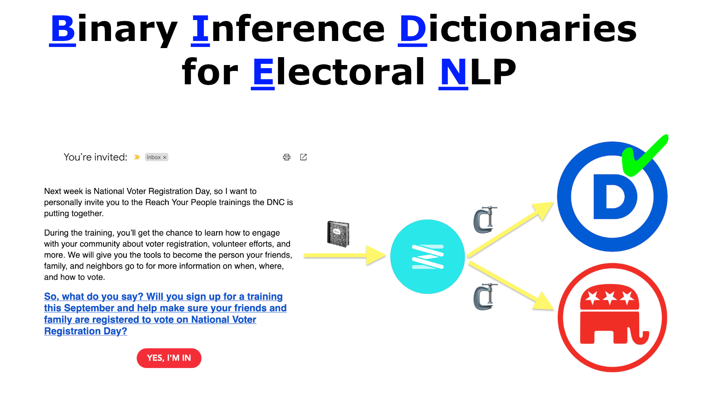

# BIDEN: Binary Inference Dictionaries for Electoral NLP
Matt Hodges
2023-10-01



This post is adapted from a Jupyter [Notebook found on
GitHub](https://github.com/hodgesmr/biden_nlp).

**BIDEN**: **B**inary **I**nference **D**ictionaries for **E**lectoral
**N**LP demonstrates a compression-based binary classification technique
that is fast at both training and inference on common CPU hardware in
Python. It is largely built on the strategies presented by
[FTCC](https://github.com/cyrilou242/ftcc), which in turn, was a
reaction to [Low-Resource Text Classification: A Parameter-Free
Classification Method with
Compressors](https://github.com/bazingagin/npc_gzip) (the gzip method).
Like FTCC, **BIDEN** is built atop of
[Zstandard](https://facebook.github.io/zstd/) (Zstd), which leverages
[dictionary compression](https://facebook.github.io/zstd/#small-data).
Zstd dictionary compression seeds a compressor with sample data, so that
it can efficiently compress *small data* (~1 KB) of similar composition.
Seeding the compressor dictionaries acts as our “training” method for
the model.

The **BIDEN** model was trained on the [ElectionEmails
2020](https://electionemails2020.org) data set — a database of over
900,000 political campaign emails from the 2020 US election cycle. **In
compliance with the data set’s
[terms](https://electionemails2020.org/downloads/corpus_documentation_v1.0.pdf),
the training data is NOT provided with this repository.** If you would
like to train the **BIDEN** model yourself, you can [request a copy of
the data for
free](https://docs.google.com/forms/d/e/1FAIpQLSdcgjZo-D1nNON4d90H2j0VLtTdxiHK6Y8HPJSpdRu4w5YILw/viewform).
The **BIDEN** model was trained on `corpus_v1.0`.

### Training and Classification

Both training and inference for **BIDEN** are fast and simple.

The model consists of two Zstd compressors, one optimized for Democratic
emails and one optimzed for Republican emails. Each is built upon a
compression dictionary. Each compression dictionary is seeded with
training sample emails from its respective party.

Classification (inference) is achieved by compressing a test sample with
both the Democratic and Republican compressors. Whichever compressor
achieves a higher compression ratio on the test sample text is
considered the inferred label.

### Cleaning the Training Data

The ElectionEmails 2020 data set is a CSV. The model consideres [two
columns](https://electionemails2020.org/downloads/corpus_documentation_v1.0.pdf):
`party_affiliation` and `body_text`. **BIDEN** is only concerned with
binary classification for Democratic and Republican labeling.

The two requirements defined in `requirements.txt` are
[Pandas](https://pypi.org/project/pandas/) and
[zstandard](https://pypi.org/project/zstandard/):

``` txt
pandas==2.1.*
zstandard==0.21.* 
```

Start by reading in the data. Since the model is only working with two
columns, drop any record that doesn’t contain both. Also filter the data
to only consider Democratic or Republican emails for the binary
classificaiton.

**Note**: this assumes you have the ElectionEmails 2020 data saved at
the relative path `data/corpus_v1.0.csv`.

``` python
from enum import Enum

import pandas as pd
import zstandard

fields = {
    'body_text': str,
    'party_affiliation': str,
}

df = pd.read_csv(
    'data/corpus_v1.0.csv',
    sep=',',
    usecols=list(fields.keys()),
    dtype=fields,
)

df.drop_duplicates(inplace=True)

d_df = df[df.party_affiliation == "Democratic Party"].dropna()
r_df = df[df.party_affiliation == "Republican Party"].dropna()

print(f'D Samples: {len(d_df.index)}')
print(f'R Samples: {len(r_df.index)}')
```

    D Samples: 127194
    R Samples: 36788

There are significantly more Democratic samples than Republican samples,
so take a random subset of the former.

``` python
max_data = min(len(d_df.index), len(r_df.index))
d_df = d_df.sample(
    n=max_data,
    random_state=9001  # random seed set for reproducibility 
).reset_index(drop=True)

r_df = r_df.sample(
    n=max_data,
    random_state=9001  # random seed set for reproducibility 
).reset_index(drop=True)

print(f'D Samples: {len(d_df.index)}')
print(f'R Samples: {len(r_df.index)}')
```

    D Samples: 36788
    R Samples: 36788

Now divide the data into training and test subsets, at an 80/20 split.

``` python
d_train_df = d_df.sample(frac=0.8, random_state=9001)  # random seed set for reproducibility 
d_test_df = d_df.drop(d_train_df.index)

r_train_df = r_df.sample(frac=0.8, random_state=9001)  # random seed set for reproducibility 
r_test_df = r_df.drop(r_train_df.index)

print(f'Democratic Training Samples: {len(d_train_df.index)}')
print(f'Democratic Test Samples: {len(d_test_df.index)}')
print(f'Republican Training Samples: {len(r_train_df.index)}')
print(f'Republican Test Samples: {len(r_test_df.index)}')
```

    Democratic Training Samples: 29430
    Democratic Test Samples: 7358
    Republican Training Samples: 29430
    Republican Test Samples: 7358

### The BIDEN model

The model consistes of two core methods: `train()` and `classify()` :

``` python
class BIDEN():
    """
    Binary Inference Dictionaries for Electoral NLP (BIDEN)

    This class allows you to train a model for classifying political content into
    Democratic or Republican categories based on compression ratios.

    Attributes:
        Classification (enum): An enumeration of political classifications (DEMOCRATIC, REPUBLICAN).
    """
    class Classification(Enum):
        """
        Enumeration of political classifications.

        Attributes:
            DEMOCRATIC (int): Represents Democratic political content.
            REPUBLICAN (int): Represents Republican political content.
        """
        DEMOCRATIC = 1
        REPUBLICAN = 2
        
    def __init__(self, encoding: str = 'utf-8'):
        """
        Initialize the BIDEN model.

        This constructor initializes the BIDEN model with empty compressors.

        Args:
            encoding (str, optional): The character encoding of the input data. Defaults to 'utf-8'.
            
        Returns:
            BIDEN: An instance of the BIDEN class.
        """
        self.d_compressor = None
        self.d_compressor = None
        self.encoding = encoding

    @property
    def trained(self) -> bool:
        """
        Check if the BIDEN model is trained.

        Returns:
            bool: True if both Democratic and Republican compressors are trained, False otherwise.
        """
        return bool(self.d_compressor and self.r_compressor)

    def train(self,
              d_training_data: str,
              r_training_data: str,
              compression_level: int = 15,
             ) -> bool:
        """
        Train the BIDEN model.

        Args:
            d_training_data (str): Democratic training data.
            r_training_data (str): Republican training data.
            compression_level (int, optional): The compression level. Defaults to 15.

        Returns:
            bool: True if training is successful, False otherwise.
        """        
        d_dictionary = zstandard.ZstdCompressionDict(
            d_training_data.encode(self.encoding),
            dict_type=zstandard.DICT_TYPE_RAWCONTENT
        )
        d_dictionary.precompute_compress(level=compression_level)
        self.d_compressor = zstandard.ZstdCompressor(dict_data=d_dictionary)

        r_dictionary = zstandard.ZstdCompressionDict(
            r_training_data.encode(self.encoding),
            dict_type=zstandard.DICT_TYPE_RAWCONTENT
        )
        r_dictionary.precompute_compress(level=compression_level)
        self.r_compressor = zstandard.ZstdCompressor(dict_data=r_dictionary)

        return self.trained

    def classify(self, sample: str) -> Classification:
        """
        Classify a sample based on compression ratios.

        Args:
            sample (str): The sample text to classify.

        Returns:
            Classification: The classification (DEMOCRATIC or REPUBLICAN).
        
        Raises:
            RuntimeError: If the model is not trained.
        """
        if not self.trained:
            raise RuntimeError("Attempted to classify with a model that is not yet trained.")
        
        encoded_sample = sample.encode(self.encoding)
        original_length = len(encoded_sample)
        d_compressed_length = len(self.d_compressor.compress(encoded_sample))
        d_ratio = d_compressed_length / original_length
        r_compressed_length = len(self.r_compressor.compress(encoded_sample))
        r_ratio = r_compressed_length / original_length

        if r_ratio < d_ratio:
            return BIDEN.Classification.REPUBLICAN

        return BIDEN.Classification.DEMOCRATIC
```

### Train the Model

To train the model, we pass the entirety of the Democratic and
Republican texts to construct [prefix
dictionaries](https://python-zstandard.readthedocs.io/en/latest/dictionaries.html).
Prefix dictionaries allow compression operations to reference raw data
within the
[dictionary](https://python-zstandard.readthedocs.io/en/latest/concepts.html#dictionaries).
Once we have two compressors instantiated and pre-seeded with our
training data, the model is trained. This is *fast*. On my 2.6 GHz
6-Core Intel Core i7, this takes roughly **30 seconds**.

``` python
d_combined_text = '\n'.join(d_train_df.body_text)
r_combined_text = '\n'.join(r_train_df.body_text)

model = BIDEN()
model.train(d_combined_text, r_combined_text)
```

    True

### Classification

Now, we can classify our test data. We could loop through each set, but
let’s combine and shuffle them together first, and loop in one go. We’ll
also convert the party affiliation strings `'Democratic Party'`, and
`'Republican Party'` into our model’s enum values:

``` python
combined_test_df = pd.concat(
    [d_test_df, r_test_df],
    ignore_index=True,
    sort=False
).sample(
    frac=1,
    random_state=9001,  # random seed set for reproducibility
).reset_index(drop=True)

combined_test_df['party_affiliation'] = combined_test_df['party_affiliation'].replace(
    to_replace=['Democratic Party', 'Republican Party'],
    value=[BIDEN.Classification.DEMOCRATIC, BIDEN.Classification.REPUBLICAN]
)

num_correct = 0
for row in combined_test_df.itertuples():
    actual_label = row.party_affiliation
    inferred_label = model.classify(row.body_text)

    if inferred_label == actual_label:
        num_correct += 1

print(f'Classification Success Rate: {((num_correct / len(combined_test_df.index))*100):.1f}%')
```

    Classification Success Rate: 98.9%

98.9% is a *shockingly* high success rate for such a simple
classification method!

### Another Email Data Set

Let’s see how it performs with emails from another data set. [Derek
Willis](https://www.thescoop.org) maintains a
[Datasette](https://datasette.io/) of [over 150,000 campaign
emails](https://political-emails.herokuapp.com/emails). Let’s grab 100
samples of each party from that collection, and see how they perform:

``` python
base_url = 'https://political-emails.herokuapp.com/emails.csv?sql='
d_query = 'select body, party from emails where party = "D" limit 100;'
r_query = 'select body, party from emails where party = "R" limit 100;'

map = {
    ' ': '+',
    ',': '%2C',
    '=': '%3D',
    '"': '%22',
    ';': '%3B',
}

for symbol, code in map.items():
    d_query = d_query.replace(symbol, code)
    r_query = r_query.replace(symbol, code)

d_url = base_url + d_query
r_url = base_url + r_query

d_dw_df = pd.read_csv(d_url)
r_dw_df = pd.read_csv(r_url)

combined_dw_df = pd.concat(
    [d_dw_df, r_dw_df],
    ignore_index=True,
    sort=False
).sample(
    frac=1,
    random_state=9001,  # random seed set for reproducibility
).reset_index(drop=True)

combined_dw_df['party'] = combined_dw_df['party'].replace(
    to_replace=['D', 'R'],
    value=[BIDEN.Classification.DEMOCRATIC, BIDEN.Classification.REPUBLICAN]
)

print('DW Sample:')
combined_dw_df.head(10)
```

    DW Sample:

<div>
<style scoped>
    .dataframe tbody tr th:only-of-type {
        vertical-align: middle;
    }
&#10;    .dataframe tbody tr th {
        vertical-align: top;
    }
&#10;    .dataframe thead th {
        text-align: right;
    }
</style>

|  | body | party |
|----|----|----|
| 0 | Hey Peter!!! You know our campaign is made by,... | Classification.DEMOCRATIC |
| 1 | https://www.jahanahayes.com/ \[https://www.jaha... | Classification.DEMOCRATIC |
| 2 | Hi there, it’s storytime: I developed a keen n... | Classification.DEMOCRATIC |
| 3 | We’re contacting a select group of patriots fo... | Classification.REPUBLICAN |
| 4 | Peter – You need to watch this. CLICK HERE OR ... | Classification.REPUBLICAN |
| 5 | Peter, you may have seen me asking for your ol... | Classification.DEMOCRATIC |
| 6 | Do you want an Official Mugshot Mug? (24-hour ... | Classification.REPUBLICAN |
| 7 | https://secure.actblue.com/donate/cdp-footer?r... | Classification.DEMOCRATIC |
| 8 | \[ https://act.katieporter.com/go/14559?t=1001&... | Classification.DEMOCRATIC |
| 9 | I hope I made you proud fighting for you at th... | Classification.REPUBLICAN |

</div>

``` python
num_correct = 0
for row in combined_dw_df.itertuples():
    actual_label = row.party
    inferred_label = model.classify(row.body)

    if inferred_label == actual_label:
        num_correct += 1

print(f'Classification Success Rate: {((num_correct / len(combined_dw_df.index))*100):.1f}%')
```

    Classification Success Rate: 93.0%

93% is still *quite good* considering that all we’re doing is
compression!

### Classifying Tweets

The Twitter API is basically useless these days, so I scrolled the
timelines of [Mike Pence](https://twitter.com/Mike_Pence) (R) and [Gavin
Newsom](https://twitter.com/GavinNewsom) (D), and copy+paste’d 5 tweets
from each. It’s a tiny sample, and not really random, but it’s neat to
see how well it does:

``` python
pence_tweets = [
    # https://twitter.com/Mike_Pence/status/1707882018258751915
    "Today, we applaud the Eighth Circuit's decision, " \
    "which is an important step in the fight to uphold and protect " \
    "the rights of parents and families in Linn-Mar. A family is the " \
    "single best unit to protect children, and we must continue to do " \
    "everything we can to empower parents over bureaucrats. The strength " \
    "of our nation is tied to the strength of our families, and we will " \
    "not stand idly by as the Radical Left attempts to indoctrinate our " \
    "children behind parents’ backs.",
    # https://twitter.com/Mike_Pence/status/1707472823269392643
    "The cause of Life is the calling of our time " \
    "and I couldn’t be more proud to have played a role in the administration " \
    "that appointed three of the justices that overturned Roe v. Wade and " \
    "returned the question of abortion to the states and the American people.",
    "Republicans are facing a Time for Choosing. " \
    # https://twitter.com/Mike_Pence/status/1707241587460186214
    "We have to choose whether or not we’re going to stay on the path " \
    "that has defined our movement since the days of Ronald Reagan and " \
    "through the Trump-Pence years or whether we’re going to follow " \
    "the siren song of populism unmoored to Conservative principles.",
    # https://twitter.com/Mike_Pence/status/1704132623617122719
    "I am for working Americans and free enterprise. These businesses " \
    "make their decisions, but at the end the of the day these businesses " \
    "are responding to the heavy hand of the green new deal agenda of " \
    "Joe Biden and the Democrats in Washington, DC.",
    # https://twitter.com/Mike_Pence/status/1703887286641873137
    "We were the first country to sanction Chinese leaders for building " \
    "concentration camps in Xinjiang and for undermining democracy in Hong Kong. " \
    "And we stood up to years of trade abuses, and imposed historic tariffs " \
    "to bring China to the negotiating table."
]

[model.classify(t) for t in pence_tweets]
```

    [<Classification.REPUBLICAN: 2>,
     <Classification.REPUBLICAN: 2>,
     <Classification.REPUBLICAN: 2>,
     <Classification.REPUBLICAN: 2>,
     <Classification.REPUBLICAN: 2>]

``` python
newsom_tweets = [
    # https://twitter.com/GavinNewsom/status/1700615276667294035
    "When people ask why I am introducing a Constitutional Amendment " \
    "on gun safety this is why. Not only has Congress stalled for YEARS on passing " \
    "common sense reforms -- judges across the country are tearing down laws that " \
    "Americans overwhelmingly support. Laws that keep us SAFE and keep guns out of " \
    "the hands of dangerous criminals. We have to push back",
    # # https://twitter.com/GavinNewsom/status/1689743766733877248
    "California will be sending search and rescue " \
    "teams to assist in Hawaii's recovery efforts. The wildfires and " \
    "devastation that Maui is experiencing is all too familiar and all " \
    "too horrifying. We stand at the ready to aid Hawaii in its time of need.",
    # https://twitter.com/GavinNewsom/status/1679579172690329601
    "A school board in Temecula decided to reject a " \
    "textbook because it mentioned Harvey Milk. CA is stepping in. " \
    "We’re going to purchase the book for these students—the same " \
    "one that hundreds of thousands of kids are already using. " \
    "If these extremist school board members won’t do their job, " \
    "we will — and fine them for their incompetence.",
    # https://twitter.com/GavinNewsom/status/1650634702271942656
    "North Dakota GOP have decided to force women to give birth. Even victims of rape. " \
    "Meanwhile, they voted against providing school meals because child hunger isn't " \
    "\"the responsibility of the state.\"" \
    "Mandating birth is state responsibility. Helping feed those kids is not. Got it.",
    # https://twitter.com/GavinNewsom/status/1643745476662132737
    "Met with some librarians today while in Florida. " \
    "They shared with me the rich, diverse background of the " \
    "town and what's at stake if we ban our kids from learning our real history."
]

[model.classify(t) for t in newsom_tweets]
```

    [<Classification.DEMOCRATIC: 1>,
     <Classification.DEMOCRATIC: 1>,
     <Classification.DEMOCRATIC: 1>,
     <Classification.DEMOCRATIC: 1>,
     <Classification.REPUBLICAN: 2>]

Neat! This small set classified 90% correctly. Further exploration with
more robust Twitter data sets is warranted.

### Closing Thoughts

Even after seeing the results, I still have a hard time believing that
this works so well! It feels like it *shouldn’t* work at all. But,
zooming out, there are a lot of relevant factors to consider. First,
there just aren’t that many people writing campaign materials. It makes
sense that word-choice and writing style would exhibit predictible
patterns. Second, campaign emails have been A/B tested into oblivion, so
there’s a systematic process that cranks out similar-sounding copy.
Third, the recipients of these emails have largely self-sorted. This
likely bolsters the expected structure and copy uniquely for each label.
Ultimately, compression algorithms optimize on patterns and
predictibility. What this shows us is that the two parties are uniquely
*predictible* in their written communications.

The idea of classification by compression is not new; Russell and Norvig
wrote about it in 1995 in the venerable [Artificial Intelligence: A
Modern Approach](https://aima.cs.berkeley.edu/3rd-ed/):


More recently, the [“gzip beats BERT”
paper](https://aclanthology.org/2023.findings-acl.426/) got a lot of
attention. What the **BIDEN** model demonstrates is that this technique
is effective and likely generalizable on modern partisan texts.

It’s worth articulating again how fast and simple this method is. No
GPUs. No Neural Networks. No N-grams. No transformers. No kNN.

I think that’s pretty cool!

### License

    Copyright (c) 2023, Matt Hodges
    All rights reserved.

    Redistribution and use in source and binary forms, with or without
    modification, are permitted provided that the following conditions are met:

    * Redistributions of source code must retain the above copyright notice, this
      list of conditions and the following disclaimer.

    * Redistributions in binary form must reproduce the above copyright notice,
      this list of conditions and the following disclaimer in the documentation
      and/or other materials provided with the distribution.

    * Neither the name of BIDEN: Binary Inference Dictionaries for Electoral NLP nor the names of its
      contributors may be used to endorse or promote products derived from
      this software without specific prior written permission.

    THIS SOFTWARE IS PROVIDED BY THE COPYRIGHT HOLDERS AND CONTRIBUTORS "AS IS"
    AND ANY EXPRESS OR IMPLIED WARRANTIES, INCLUDING, BUT NOT LIMITED TO, THE
    IMPLIED WARRANTIES OF MERCHANTABILITY AND FITNESS FOR A PARTICULAR PURPOSE ARE
    DISCLAIMED. IN NO EVENT SHALL THE COPYRIGHT HOLDER OR CONTRIBUTORS BE LIABLE
    FOR ANY DIRECT, INDIRECT, INCIDENTAL, SPECIAL, EXEMPLARY, OR CONSEQUENTIAL
    DAMAGES (INCLUDING, BUT NOT LIMITED TO, PROCUREMENT OF SUBSTITUTE GOODS OR
    SERVICES; LOSS OF USE, DATA, OR PROFITS; OR BUSINESS INTERRUPTION) HOWEVER
    CAUSED AND ON ANY THEORY OF LIABILITY, WHETHER IN CONTRACT, STRICT LIABILITY,
    OR TORT (INCLUDING NEGLIGENCE OR OTHERWISE) ARISING IN ANY WAY OUT OF THE USE
    OF THIS SOFTWARE, EVEN IF ADVISED OF THE POSSIBILITY OF SUCH DAMAGE.
