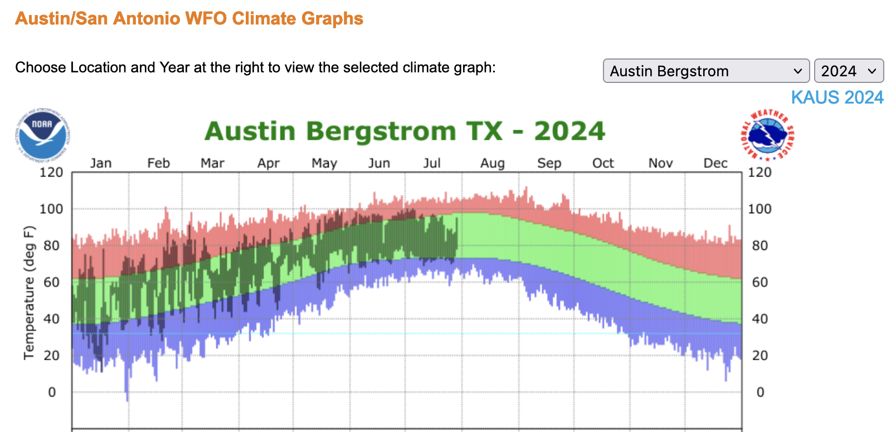
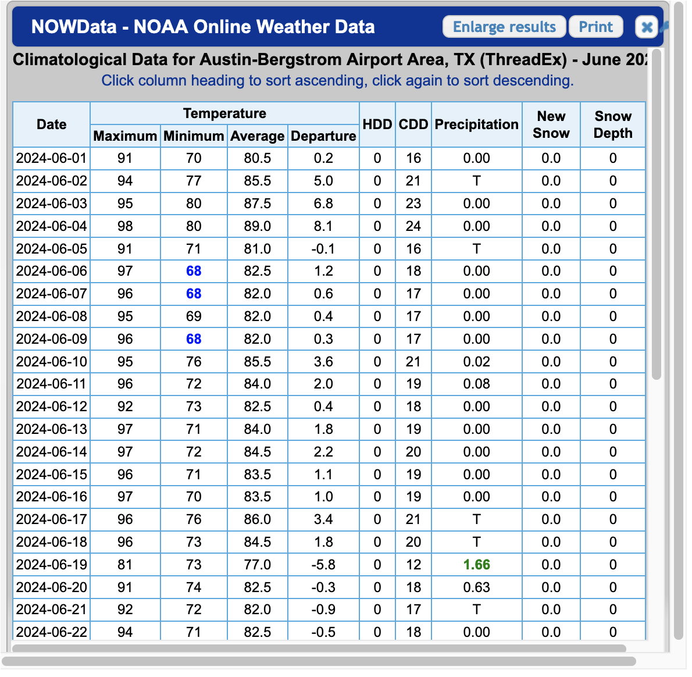
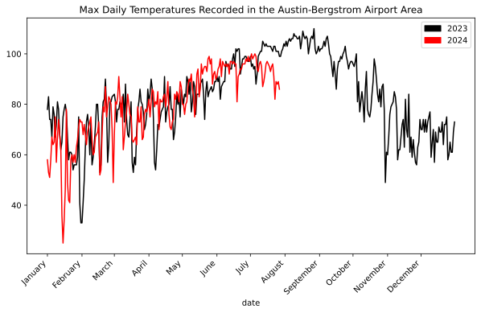
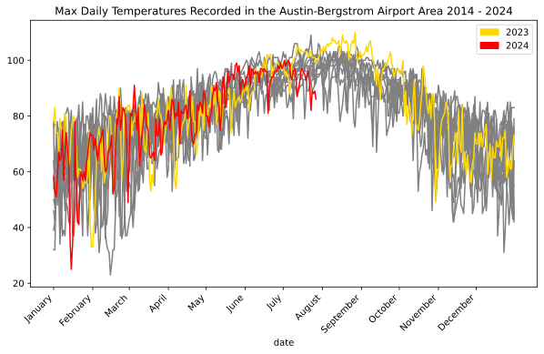

# Austin, Texas: Hot or Not?
Matt Hodges
2024-07-30

I live in Austin, Texas. And last summer I felt like:


But this year, I’ve felt more like:


And earlier today I thought aloud to the group chat:

> I need to look up if Austin is being weird this year. Last year we got
> to like 50 consecutive days over 100. I don’t think we’ve cracked 100
> yet this year? Is there a website that answers this question?

Last year the heat was so bad that local news outlets were keeping a
[running
tally](https://www.kxan.com/weather/weather-blog/july-2023-100-degrees-streak/)
of how many consecutive days we broke 100°F. It turns out we had 45
straight days of triple-digit heat in 2023, which began on July 8 and
continued through August 22. I’m writing this on July 30, 2024 and I
can’t recall a single day above 100°F yet this year.

Year-vs-year location based time series temperature data absolutely
seems like a thing that should exist. Every month or so someone posts
the updated [doom surface air temperature
graph](https://www.nytimes.com/2023/09/07/learning/whats-going-on-in-this-graph-sept-13-2023.html),
so surely I can just look that data up for my location, right?

On [weather.gov](https://weather.gov) you can get your [own version of
this graph](https://www.weather.gov/ewx/climategraphs). Pretty cool! But
only for the current year:



You can also get tabular historic data within monthly windows that
sometimes come as html and sometimes come as PDF. Also cool. But not
convenient:



After about 15 minutes of clicking, I couldn’t find a great way to
generate the viz I was looking for; and I couldn’t get an easy data
export. Maybe there’s a one-click way to get CSVs, but I didn’t find it.
But after about 5 more minutes of googling, I did find the National
Oceanic and Atmostpheric Administration’s [Climate Data
Online](https://www.ncei.noaa.gov/cdo-web/) portal, which has an
[API](https://www.ncdc.noaa.gov/cdo-web/webservices/v2).

> NCDC’s Climate Data Online (CDO) offers web services that provide
> access to current data. This API is for developers looking to create
> their own scripts or programs that use the CDO database of weather and
> climate data.

Hey, that sounds like me!

The API needs an [access
token](https://www.ncdc.noaa.gov/cdo-web/token). Wonderfully, all I
needed to do was type in my email address and roughly one second later
an access token landed in my inbox. LFG.

From here it took a bit more reading to grok what data is available and
in what formats, but I eventually found out about GHCND, or the [Global
Historical Climatology Network
daily](https://www.ncei.noaa.gov/products/land-based-station/global-historical-climatology-network-daily):

> The Global Historical Climatology Network daily (GHCNd) is an
> integrated database of daily climate summaries from land surface
> stations across the globe. GHCNd is made up of daily climate records
> from numerous sources that have been integrated and subjected to a
> common suite of quality assurance reviews.

That sounds like it might contain what I’m looking for.

Next, there are a lot of ways to filter this data by location, but
`stationid` caught my attention. I found [this list of GHCND
stations](https://www.ncei.noaa.gov/pub/data/ghcn/daily/ghcnd-stations.txt)
and decided to go with `AUSTIN BERGSTROM INTL AP` because it’s the same
location from the tabular data above. It has the identifier
`USW00013904`.

After a quick `pip install requests pandas matplotlib` and tossing my
token into a `NCDC_CDO_TOKEN` environment variable, we’re ready to jam.

First let’s get a function to grab some data. I’m intersted in comparing
year over year, so let’s grab a year at a time.

``` python
import os

import matplotlib.patches as mpatches
from matplotlib import pyplot as plt
import pandas as pd
import requests

def get_max_temps(year, limit=366):
    token = os.getenv("NCDC_CDO_TOKEN")
    start_date = f"{year}-01-01"
    end_date = f"{year}-12-31"
    url = "https://www.ncdc.noaa.gov/cdo-web/api/v2/data"
    params = {
        "datasetid": "GHCND",
        "stationid": "GHCND:USW00013904",
        "startdate": start_date,
        "enddate": end_date,
        "datatypeid": "TMAX",  # max temp
        "units": "standard",  # 🇺🇸
        "limit": limit,  
    }
    headers = {
        "token": token  
    }

    response = requests.get(url, headers=headers, params=params)
    data = response.json()
    return data
```

Let’s look at the first three:

``` python
get_max_temps(2024, limit=3)
```

``` json
{
    "metadata": {
        "resultset": {
            "offset": 1,
            "count": 209,
            "limit": 3
        }
    },
    "results": [
        {
            "date": "2024-01-01T00:00:00",
            "datatype": "TMAX",
            "station": "GHCND:USW00013904",
            "attributes": ",,W,2400",
            "value": 58.0
        },
        {
            "date": "2024-01-02T00:00:00",
            "datatype": "TMAX",
            "station": "GHCND:USW00013904",
            "attributes": ",,W,2400",
            "value": 53.0
        },
        {
            "date": "2024-01-03T00:00:00",
            "datatype": "TMAX",
            "station": "GHCND:USW00013904",
            "attributes": ",,W,2400",
            "value": 51.0
        }
    ]
}
```

Great! We can pull from the `date` and the `value` fields. Let’s grab
all of 2024 and shove it into a DataFrame.

``` python
def to_df(data):
    # Extract date and truncate off the time part
    dates = [item["date"][:10] for item in data["results"]]

    # Grab the max temp value for each date
    max_temps = [item["value"] for item in data["results"]]

    # Create a DataFrame
    df = pd.DataFrame({"date": dates,"max_temp": max_temps})

    # Set the `date` col as a datetime and make it the index
    df["date"] = pd.to_datetime(df["date"])
    df.set_index("date", inplace=True)
    
    return df
```

Quick spot check:

``` python
df_2024 = to_df(get_max_temps(2024))

print(f"Head:\n{df_2024.head()}")
print(f"Tail:\n{df_2024.tail()}")
print(f"Format:\n{df_2024.dtypes}")
```

    Head:
                max_temp
    date                
    2024-01-01      58.0
    2024-01-02      53.0
    2024-01-03      51.0
    2024-01-04      58.0
    2024-01-05      67.0
    Tail:
                max_temp
    date                
    2024-07-23      82.0
    2024-07-24      89.0
    2024-07-25      88.0
    2024-07-26      89.0
    2024-07-27      86.0
    Format:
    max_temp    float64
    dtype: object

Awesome. I’m writing this on `2024-07-30` and it’s got data up through
`2024-07-27`. Good enough for me!

Now to actually get at what I was trying to do this whole time. I’m
going to grab DataFrames for 2023 and 2024, and plot a time series of
each.

``` python
df_2023 = to_df(get_max_temps(2023))

# Adjust 2023 dates to match the 2024 index
# This is how we shift the graph to overlap
# If you don't do this, 2024 comes after, not on top of, 2023
df_2023.index = df_2023.index.map(lambda x: x.replace(year=2024))

# Plot the data
fig, ax = plt.subplots(figsize=(10, 6))
df_2023.plot(ax=ax, color="black", legend="2023")
df_2024.plot(ax=ax, color="red", legend="2024")

# Sett x-axis to display month labels
ax.set_xticks(
    pd.date_range(
        start=df_2023.index.min(),
        end=df_2023.index.max(),
        freq='MS',
    )
)
ax.set_xticklabels(
    pd.date_range(
        start=df_2023.index.min(),
        end=df_2023.index.max(),
        freq='MS',
    ).strftime('%B')
)

# Formatting
black_patch = mpatches.Patch(color="black", label="2023")
red_patch = mpatches.Patch(color="red", label="2024")
plt.legend(handles=[black_patch, red_patch])
ax.set_title("Max Daily Temperatures Recorded in the Austin-Bergstrom Airport Area")
plt.xticks(rotation=45)

plt.show()
```



So that’s pretty cool. Most of 2024 has tracked 2023 for daily high
temperatures. But not July. July has been weirdly cooler than last year.
Or last year was weirdly hotter than normal.

Actually, let’s see if we can tease that out. Let’s grab the past 10
years.

``` python
import time

# Create a dictionary of year:DataFrame
year_dfs = {}
for year in range(2014, 2024):
    year_dfs[year] = to_df(get_max_temps(year))
    # Be a nice internet citizen and wait between requests
    time.sleep(5)

# Adjust pre-2024 dates to match the 2024 index
# This is how we shift the graph to overlap
# If you don't do this, 2024 comes after, not on top of, 2023
for df in year_dfs.values():
    df.index = df.index.map(lambda x: x.replace(year=2024))

# Plot the data
fig, ax = plt.subplots(figsize=(10, 6))
for year, df in year_dfs.items():
    if year == 2023:
         df.plot(ax=ax, label="2023", color="gold")
    else:
        df.plot(ax=ax, color="gray")
df_2024.plot(ax=ax, label="2024", color="red")

# Sett x-axis to display month labels
ax.set_xticks(
    pd.date_range(
        start=year_dfs[2023].index.min(),
        end=year_dfs[2023].index.max(),
        freq='MS'
    )
)
ax.set_xticklabels(
    pd.date_range(
        start=year_dfs[2023].index.min(),
        end=year_dfs[2023].index.max(),
        freq='MS',
    ).strftime('%B')
)

# Formatting
ax.set_title(
    "Max Daily Temperatures Recorded in the Austin-Bergstrom Airport Area 2014 - 2024"
)
plt.xticks(rotation=45)
gold_patch = mpatches.Patch(color="gold", label="2023")
red_patch = mpatches.Patch(color="red", label="2024")
plt.legend(handles=[gold_patch, red_patch])

plt.show()
```



Seems like Austin’s 2023 summer was on the hotter side, and so far the
2024 summer is on the cooler side.

And was I correct that we haven’t cracked 100 yet this year?

``` python
print(df_2024[df_2024["max_temp"] >= 100])
```

                max_temp
    date                
    2024-07-02     100.0
    2024-07-05     100.0

Computers!
