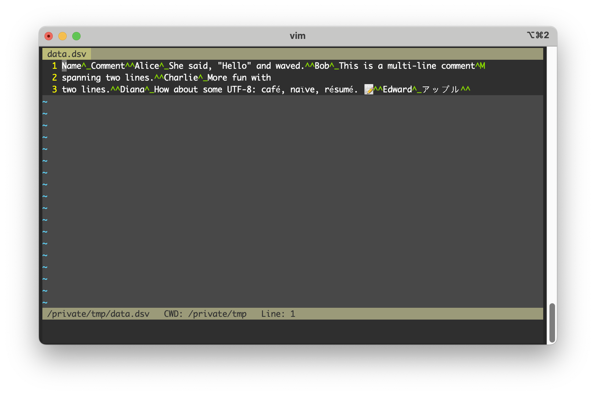
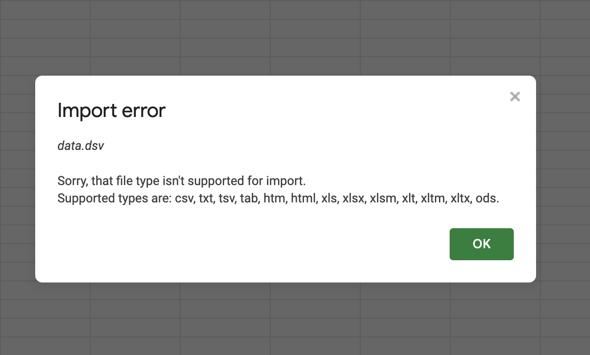

# CSVs Are Kinda Bad. DSVs Are Kinda Good.
Matt Hodges
2024-08-13

CSVs are kinda bad. We know this, but sometimes it’s helpful to remember
why they’re kinda bad. Maybe you need to work with CSVs and you’re using
Python, because Python is kinda good. And someone else somewhere wrote a
CSV:

``` python
import csv

data = [
    ['Name', 'Comment'],
    ['Alice', 'She said, "Hello" and waved.'],
]

with open('/tmp/data.csv', 'w', newline='') as file:
    writer = csv.writer(file, quoting=csv.QUOTE_MINIMAL)
    writer.writerows(data)
```

And you read the CSV:

``` python
with open('/tmp/data.csv', 'r') as file:
    reader = csv.reader(file, quoting=csv.QUOTE_NONE)
    for row in reader:
        print(row)
```

    ['Name', 'Comment']
    ['Alice', '"She said', ' ""Hello"" and waved."']

Oh darn, the data had a `"` character inside the comment field and it
was escaped by doubling it `""` which is one way to do that but you
didn’t know so your reader is broken.

Or maybe they wrote it this way:

``` python
data = [
    ['Name', 'Comment'],
    ['Alice', 'She said, "Hello" and waved.'],
]

with open('/tmp/data.csv', 'w', newline='') as file:
    writer = csv.writer(file, quoting=csv.QUOTE_NONE, escapechar='\\')
    writer.writerows(data)
```

And you read the CSV:

``` python
with open('/tmp/data.csv', 'r') as file:
    reader = csv.reader(file, quoting=csv.QUOTE_NONE,)
    for row in reader:
        print(row)
```

    ['Name', 'Comment']
    ['Alice', 'She said\\', ' \\"Hello\\" and waved.']

Oh darn, you didn’t get the escape character correct so now your’ve got
a bunch of malformed data.

Or maybe they wrote this CSV with a `|` delimiter because people don’t
type `|` very often:

``` python
data = [
    ['Name', 'Score'],
    ['Alice', '100']
]

with open('/tmp/data.csv', 'w', newline='') as file:
    writer = csv.writer(file, delimiter='|')
    writer.writerows(data)
```

And you read the CSV:

``` python
with open('/tmp/data.csv', 'r') as file:
    reader = csv.reader(file, delimiter=',')
    for row in reader:
        print(row)
```

    ['Name|Score']
    ['Alice|100']

Oh darn, you didn’t know they were being clever with the delimiter so it
didn’t break up the fields at all.

Or maybe you got a CSV from someone who uses a Windows machine and so
they tend to use `\r\n` for newlines:

``` python
data = [
    ['Name', 'Score'],
    ['Alice', '100']
]

with open('/tmp/data.csv', 'w', newline='\r\n') as file:
    writer = csv.writer(file)
    writer.writerows(data)
```

And you, on a not-Windows machine, read the CSV:

``` python
with open('/tmp/data.csv') as file:
    reader = csv.reader(file)
    for row in reader:
        print(row)
```

    ['Name', 'Score']
    []
    ['Alice', '100']
    []

Oh darn, you didn’t anticipate that newlines might be different across
platforms, so now every other line in your data is blank.

But then maybe you figure that out and you anticipate the `\r\n`, but
then some newlines find their way into the input data:

``` python
data = [
    ['Name', 'Comment'],
    ['Bob', 'This is a multi-line comment\r\nspanning two lines.']
]

with open('/tmp/data.csv', 'w', newline='\r\n') as file:
    writer = csv.writer(file, quoting=csv.QUOTE_NONE, escapechar='\\')
    writer.writerows(data)
```

And you read the CSV:

``` python
with open('/tmp/data.csv', 'r', newline='\r\n') as file:
    reader = csv.reader(file, quoting=csv.QUOTE_NONE, escapechar='\\')
    for row in reader:
        print(row)
```

    ['Name', 'Comment']
    ['Bob', 'This is a multi-line comment\r\r']
    ['spanning two lines.']

Oh darn, you’ve got `CR` and line breaks and it’s all a mess.

But then maybe you find the Python documentation
[says](https://docs.python.org/3/library/csv.html#id4) there’s this one
weird trick to handle newlines:

> If `newline=''` is not specified, newlines embedded inside quoted
> fields will not be interpreted correctly, and on platforms that use
> `\r\n` linendings on write an extra `\r` will be added. It should
> always be safe to specify `newline='`’, since the csv module does its
> own (universal) newline handling.

And then you go look up what [universal
newlines](https://docs.python.org/3/glossary.html#term-universal-newlines)
are.

And then you find out that there are different
[Dialects](https://docs.python.org/3/library/csv.html#csv.Dialect) of
CSVs.

And then you learn that Python has a
[Sniffer](https://docs.python.org/3/library/csv.html#csv.Sniffer) that
claims it can deduce the CSV format for you.

And then you realize that the data format needs its format deduced and
so now you have to become The Joker.

The uninitiated reader might say, “hah, Python is kinda bad!” but
actually Python is kinda good! The standard `csv` module *has* to handle
all these formatting options because CSVs are all one big edge case. And
CSVs are all one big edge case because the decision to use commas and
tabs and pipes and quotes and newlines to structure the data directly
conflict with possible values of the data itself. And so we have to do
escaping nonsense and quoting nonsense and line terminator nonsense.

We could skip all of this if we just used a proper delimiter. ASCII has
this! Go pop open any ASCII character table and you’ll find these
[gems](https://en.wikipedia.org/wiki/Delimiter#ASCII_delimited_text):

- **28** (FS) : file separator
- **29** (GS) : group separator
- **30** (RS) : record separator
- **31** (US) : unit separator

And we don’t even need all four of them. If we used `31` as a field
delimiter and `30` instead of newlines, we solve every single edge case
from above. Why? Because these are non-printing characters that should
never appear in a text-stream data set.

Let’s try it out. Writing delimiter-separated values (I made up that
name and file extension) data is very easy:

``` python
from dataclasses import dataclass


class DSV():
    @property
    def delimiter(cls) -> bytes:
        return b'\x1F'
    
    @property
    def record_separator(cls) -> bytes:
        return b'\x1E'
    
    @property
    def encoding(cls) -> str:
        return 'utf-8'


@dataclass
class DSVWriter(DSV):
    output_file: str

    def write(self, data: list[list]) -> None:
        with open(self.output_file, 'wb') as file:
            for row in data:
                encoded_row = self.delimiter.join(
                    field.encode(self.encoding) for field in row
                )
                file.write(encoded_row + self.record_separator)

```

The reader takes a bit more work to implement, since we need to buffer
our input and split on our control characters:

``` python
@dataclass
class DSVReader(DSV):
    input_file: str
    chunk_size : str = 1024
    _buffer: bytes = b""

    def read(self) -> None:
        with open(self.input_file, 'rb') as file:
            chunk = file.read(self.chunk_size)
            
            while chunk:
                self._buffer += chunk

                # Process complete records in the buffer
                while self.record_separator in self._buffer:
                    record, self._buffer = self._buffer.split(
                        self.record_separator,
                        1,
                    )
                    fields = record.split(self.delimiter)
                    print([field.decode(self.encoding) for field in fields])
                
                chunk = file.read(self.chunk_size)

            # Process any remaining data in the buffer
            if self._buffer:
                fields = self._buffer.split(self.delimiter)
                print([field.decode(self.encoding) for field in fields])
```

And now we can interface by simply writing and reading the data. We
don’t have to think about the delimiter because we’ve got a standard,
non-conflicting delimiter. We don’t have to think about newlines because
we aren’t using those for control characters. We also don’t have to
think about quotes because we also aren’t using those for control
characters. And we don’t have to think about escaping delimiters or
newlines or quotes for all those same reasons.

Writing:

``` python
data = [
    ['Name', 'Comment'],
    ['Alice', 'She said, "Hello" and waved.'],
    ['Bob', 'This is a multi-line comment\r\nspanning two lines.'],
    ['Charlie', 'More fun with\ntwo lines.'],
    ['Diana', 'How about some UTF-8: café, naïve, résumé. 📝'],
    ['Edward', 'アップル'],
]

writer = DSVWriter('/tmp/data.dsv')
writer.write(data)
```

And reading:

``` python
reader = DSVReader('/tmp/data.dsv')
reader.read()
```

    ['Name', 'Comment']
    ['Alice', 'She said, "Hello" and waved.']
    ['Bob', 'This is a multi-line comment\r\nspanning two lines.']
    ['Charlie', 'More fun with\ntwo lines.']
    ['Diana', 'How about some UTF-8: café, naïve, résumé. 📝']
    ['Edward', 'アップル']

🎉 And just like that, we’ve got data going in and out of our writer and
reader that has a bunch of weird stuff like quotes and newlines and
carriage returns and we don’t need to care! We didn’t have to escape
anything because we don’t have any printable characters that would
conflict with our control characters.

You might have some different ideas about reader/writer functionality,
or character encodings (as long as they’re supersets of ASCII) or why I
should be morally scolded for not implementing this in Rust, but the
point is you don’t have to think about the fagility of CSVs to go work
on those ideas!

💡 **Quick aside:** I first learned about these ASCII delimiters while
[working with `.fec`
files](https://www.fec.gov/help-candidates-and-committees/filing-reports/fecfile-software/).
For whatever reason, the Federal Election Commission in the United
States also decided that they needed to ditch the comma, but they landed
on using ASCII character `28` which is supposed to be used as a file
separator not a field saparator. I have no idea why they picked that one
when `31` was right there. Anyway, the FEC also has a [tool called
`fs2comma.exe`](https://www.fec.gov/help-candidates-and-committees/filing-reports/data-conversion-tools/)
that turns it back into a CSV format, and a couple of years I filed a
FOIA request and [got the source
code](https://github.com/hodgesmr/fs2comma).

So what’s the downside? This custom FEC tooling might give you a hint.

For starters, it’s rather unreadable when opened in a text editor. But I
bet you don’t really do that with your CSVs all that often anyway!



And Google Sheets hates the `.dsv` file extension, but remember I made
that up.



And if you change it to `.csv` but tell Google Sheets to “detect
automatically” the delimiter, it can’t.


And if you try to specify the delimiter yourself on the Google Sheets
import it’s not entirely clear how you would type a non-printable
character into the textbox.


And if you want to use Python’s `csv` module but just swap around the
control characters, you can’t because opinions were
[hardcoded](https://docs.python.org/3/library/csv.html#csv.Dialect.lineterminator):

> **Note:** The reader is hard-coded to recognise either `'\r'` or
> `'\n'` as end-of-line, and ignores lineterminator. This behavior may
> change in the future.

And all this is to say that the major downside is we have decades of
tools built around handling the weirdness of CSVs but not so many tools
built around using the delimiters the creators of ASCII gave us and so
depending on what you’re doing it might be easier to just use the tools
we have.

But sometimes you’re writing software that produces data on one side and
consumes data on the other side and sometimes that data comes from users
who are hostile, intoxicated, or both, and you just want to pass that
around and not think about it and maybe the beauty of a standard from
the 1960s is a better choice.

Data!
