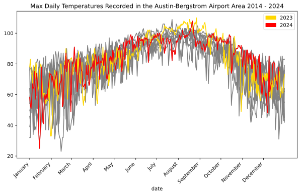

# Part 2: Austin Texas, Hot or Not?
Matt Hodges
2024-12-26

Over the Summer I
[wondered](https://matthodges.com/posts/2024-07-30-austin-hot-or-not/)
whether Austin was having a cooler season than normal. Through the magic
of public weather data, I was able to discover that the answer was
mostly yes! But I also wrote that post at the end of July, and a lot of
2024 was still left to go. So here I am, sitting at my kitchen counter
the day after Christmas, ready to definitively answer the question for
the year: Austin, hot or not? Code for how all of this (mostly) works is
in the original post, so this update is relatively brief with only the
graphs.

First, I wanted to quickly glance at 2023 vs 2024. For a little bit
there, this Summer was cooler than last Summer. But then we had a pretty
hot week in late August. Year over year, the Summer looks like it was
generally cooler than last year, but the Fall has been slightly warmer:

But comparing two years doesn’t really reveal a trend (or lack of trend)
so here are 2023 and 2024 highlighted over the previous ten years. It’s
kindof a mess, like if Hulk Hogan couldn’t color within the lines. But
if you squint you can somewhat pick out some insights.

So here’s the final viz I landed on. For most of the Winter and Spring,
Austin was oscillating around its 10-year trailing average maximum daily
temperature. Then as Summer hit, max temperatures dipped a little bit
below average, spiked up in mid August, and then fell again slightly
below average until September. From there we’ve been mostly above
average!

As a final glimpse, we can see how many 2024 days (through December 23,
my last day of available data) have crossed above the average max
temperature, and how many days stayed below:

    Above Average: 219
    Below Average: 137

Thermometers!
