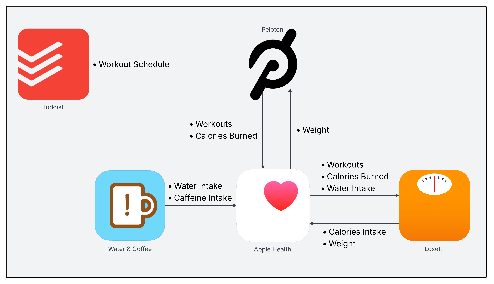

# Tracking Five Years Of Health Data
Matt Hodges
2025-10-12

This week I hit three small but satisfying milestones: I logged my
1,000th Peloton ride, I achieved my target body weight (again), and I
completed five years of tracking my diet and exercise data. I didn’t set
out to make this some big quantified self-experiment. It started more as
triage; a way to feel like I was regaining control of something after
years of working on campaigns where control is the first thing to go.

In October 2020, as that presidential election approaching an end, I was
running on fumes. I’d spent 494 days — usually seven days a week and
often twelve hours a day — [working to defeat Donald
Trump](https://matthodges.com/posts/2020-11-10-thank-you/). What’s
strange is that throughout the campaign I felt like I never had time to
eat, and somehow I still gained weight. By the end I was the heaviest
I’d ever been and completely drained. The bitter reality about campaign
work is that the moment you finish the marathon, your job disappears.
One day you’re operating at full throttle; the next, you’re unemployed
with nothing but free time.

So I decided to channel it. I couldn’t keep pretending my 20s metabolism
was coming back, and I figured data might help where willpower hadn’t. I
wanted to treat my health like a project: something measurable,
improvable, trackable. So I composed a little ecosystem of apps and
devices to log everything: what I ate, how I exercised, how much water I
drank, what I weighed. It was a nerd’s approach to fitness, but it works
for me.

This is my health app stack:

Here’s how it works:

[**Peloton**](https://www.onepeloton.com/) — This is the engine behind
my workouts. I wasn’t a sports kid in high school, and I never went to
the gym in college or my 20s. I knew I couldn’t rely on my own judgment
or discipline here. Peloton works for me because the instructors design
every workout, I like riding a stationary bike, and the entertainment
value makes the time fly. The Bike and subscription aren’t cheap (but
neither are gym memberships), but they’re absolutely worth it to me. I
actually started with a bootleg setup: just the iOS app connected to a
[Schwinn
IC4](https://www.schwinnfitness.com/product/ic4-indoor-cycling-bike/100873.html).
It worked surprisingly well until the IC4 started breaking down and
needed hundreds of dollars in repairs. Upgrading to a proper Peloton
Bike was a big step up.

[**LoseIt!**](https://www.loseit.com/) — One of the most popular
diet-tracking apps. I’d tried
[MyFitnessPal](https://www.myfitnesspal.com/) before and bounced right
off it. The two apps are nearly identical, but somehow switching
platforms was a psychological reset that made it click. LoseIt’s food
database is impressively accurate, the smart reminders to log meals
actually help, and the ability to fine-tune calorie and nutrient goals
is excellent. After experimenting with a few diet approaches, I’ve
landed on what works best for me (not health advice for you!): stay a
good clip below 2,000 calories a day, low carbs, and low sugar. A few
years back, they ran a Thanksgiving sale offering lifetime premium
access for a one-time payment; I jumped on it and haven’t paid another
dime since.

[**Water &
Coffee**](https://apps.apple.com/us/app/water-coffee/id1475423483/) — A
delightful little app that does exactly two things: track your water and
track your caffeine. By the end of the 2020 campaign, I was drinking an
entire pot of coffee a day and barely touching water. Logging both
helped me cut my caffeine drastically (I’m down to about two cups a day)
and reminded me to hydrate like an adult. The app is simple, free,
privacy-respecting, and ad-free. I liked it so much I sent the developer
a tip just to say thanks.

[**Apple Health**](https://www.apple.com/health/) — This is the data
orchestration layer. I rarely open the app itself, but since everything
connects through
[HealthKit](https://developer.apple.com/documentation/healthkit), the
data just flows. When I burn calories in Peloton, that data moves
automatically into LoseIt without me touching a thing. It’s nice having
all the plumbing between these apps handled, and that the data
ultimately lives inside my Apple account in my custody.

[**Todoist**](https://www.todoist.com/) — Not technically a health app,
but essential for keeping me consistent. Todoist’s free tier is
surprisingly powerful, and it’s where I schedule all my workouts. I have
a recurring project called *Weekly Exercise* that lays out the days and
durations for each ride. Even before the recent AI boom, Todoist
supported natural-language scheduling: you can type something like
*\#health 45 minute Peloton every Sunday*, and it automatically tags and
repeats it for you. It’s simple, structured accountability.

Here’s the thing about a stack: you have to actually use it. Over the
past five years, I’ve had stretches of real success, and just as many
where I let things slide. Every single backslide came down to the same
cause: I stopped sticking to the system.

Life happens. You move, you change jobs, you buy a house, and suddenly
there’s an endless list of reasons not to eat well or work out. I’d go
through phases where I stopped logging food altogether because I didn’t
want to face the evidence; typing in pizza and beer only made me feel
worse. Unsurprisingly, when I stopped tracking what I ate, I also
stopped exercising as much. And just as predictably, that’s when the
weight crept back on.

The nice thing about having five years of data is that I can actually
see it. Here’s my weight over time ([I like to use
PCHIP](https://matthodges.com/posts/2024-08-08-spline-pchip/)), shown as
a percentage of my target weight:

> [!TIP]
>
> Apple Health, Peloton, and LoseIt all let you export various data from
> your accounts. Peloton gives you a tidy CSV of all your workouts.
> LoseIt will give you a zip of lots data classes, also in CSV. Apple
> Health hands you gigabytes of XML, full of things like workouts,
> steps, weight, and even extremely granular heart-rate measurements.

Pretty wild how much my weight lines up with life events! You can see
how the abundant Austin nightlife impacted my habits, how the election
cycles align with local maxima, and how the stresses of moving and a
home purchase interfere with my goals. But these aren’t the direct
causes. Life stresses affect how much I’m exercising and how well I’m
eating, which then affect my ability to lose or maintain weight. Where I
see a quick drop in weight is also where I’m exercising the most, and
sticking to my diet the best.

For me, diet, exercise, and quantitative metrics work!
