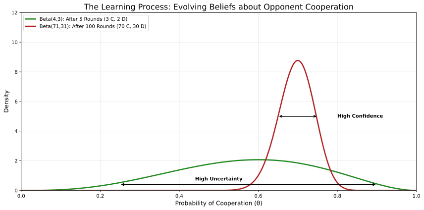

# Claude in a Game Theory Tournament
Matt Hodges
2025-12-14

I’ve been playing around with Claude Code, and I wanted to see what
happens when you give it something genuinely open-ended. Not “implement
this feature” or “fix this bug” but something that would typically
require actual creativity from a human. Something where the agent needs
to look at a landscape of existing solutions, find the gaps, and make
something new.

The [Iterated Prisoner’s
Dilemma](https://en.wikipedia.org/wiki/Prisoner%27s_dilemma#The_iterated_prisoner's_dilemma)
felt perfect for this. It’s a well-studied problem with decades of
research and it allows you to objectively measure how good your strategy
is by running a tournament. So I gave Claude Code (Sonnet 4.5) one
prompt to look at the [Axelrod
library’s](https://github.com/Axelrod-Python/Axelrod) 200+ IPD
strategies, come up with something novel that could actually compete,
and build it.

### Time For Some Game Theory

The traditional [Prisoner’s
Dilemma](https://en.wikipedia.org/wiki/Prisoner%27s_dilemma) is one of
game theory’s most studied problems. Two players simultaneously choose
to either **Cooperate** or **Defect**. The payoff matrix creates a
tension between individual and collective benefit:

|                         | You Cooperate           | You Defect         |
|-------------------------|-------------------------|--------------------|
| **Opponent Cooperates** | R = 3 (Reward)          | T = 5 (Temptation) |
| **Opponent Defects**    | S = 0 (Sucker’s payoff) | P = 1 (Punishment) |

The dilemma: mutual cooperation yields 3 points each (Reward), but
you’re tempted to defect for 5 points while your opponent gets 0
(Sucker’s payoff). But if you both defect, you each only get 1 point.

**In a one-shot game, rational self-interest says defect.** But what if
you play repeatedly?

In 1980, political scientist [Robert
Axelrod](https://en.wikipedia.org/wiki/Robert_Axelrod_(political_scientist))
adjusted the idea, and organized a computational tournament where
experts across various fields submitted strategies for the **Iterated
Prisoner’s Dilemma (IPD)**. The traditional Prisoner’s Dilemma was a
single, one-shot game: two players choose cooperate or defect once,
receive payoffs, and the interaction ends. Axelrod’s Iterated Prisoner’s
Dilemma instead pits many strategies against each other in a round-robin
tournament, where each pair plays the same opponent repeatedly over many
rounds and total scores are accumulated. Because moves can depend on the
history of play, strategies can reward cooperation, punish defection,
and recover from mistakes.

The winner was [Anatol
Rapoport](https://en.wikipedia.org/wiki/Anatol_Rapoport) and his
strategy **[Tit For Tat](https://en.wikipedia.org/wiki/Tit_for_tat)**:
start by cooperating, then mirror your opponent’s last move. The
simplicity surprised everyone. More complex strategies lost to this
extremely basic algorithm.

Axelrod’s 1984 book *[The Evolution of
Cooperation](https://en.wikipedia.org/wiki/The_Evolution_of_Cooperation)*
analyzed why:

- **Nice strategies** (never defect first) tended to win in the long run
- **Forgiving strategies** (don’t hold grudges forever) did well
- **Clear strategies** (opponents can understand your pattern)
  encouraged cooperation
- **Retaliatory strategies** (punish defection) prevented exploitation

The key discovery was that while the traditional Prisoner’s Dilemma
elevated defection as the logical play, the Iterated Prisoner’s Dilemma
tended to reward cooperation. These findings influenced fields from
evolutionary biology to international relations. If cooperation can
emerge from pure self-interest in simple games, perhaps it can explain
cooperation in nature and human societies. [Veritasium did a great video
summarizing the book](https://www.youtube.com/watch?v=mScpHTIi-kM), but
you should read the book!

The [Axelrod library](https://github.com/Axelrod-Python/Axelrod)
continues this research. It’s a comprehensive Python framework
containing:

- 200+ strategy implementations (classic and modern)
- Tournament infrastructure
- Statistical analysis and visualization tools
- [Moran process](https://en.wikipedia.org/wiki/Moran_process)
  simulation for evolutionary dynamics
- Support for noise, probabilistic endings, and spatial tournaments

Strategies range from simple ([Tit For
Tat](https://axelrod.readthedocs.io/en/stable/reference/strategy_index.html#axelrod.strategies.titfortat.TitForTat),
[Grudger](https://axelrod.readthedocs.io/en/stable/reference/strategy_index.html#axelrod.strategies.grudger.Grudger))
to complex (neural networks, finite state machines, zero-determinant
strategies). It’s maintained by researchers and serves as a testbed for
game theory experiments.

### Claude In The Tournament

So I cloned the Axelrod library and gave Claude Code this prompt:

> *This is the Axelrod python library that implements the
> tournament-style iterative prisoners’ dilemma popularized by Robert
> Axelrod in his seminal work The Evolution of Cooperation. We’re going
> to try to create a novel and competitive strategy, one that stands on
> its own and can reliably compete with the bests known strategies, like
> Tit-For-Tat. The repository ships with over 200 strategies already for
> the tournament. I would like you to think hard about what a novel new
> strategy could be. This is going to require creativity and thinking
> outside the box. It’ll likely take some iteration too. Let’s begin.
> Explore the repository for existing strategies, understand how the
> tournament system works, and then, once you’ve created a novel and
> creative idea, implement the new strategy. Once implemented, run it in
> a tournament to see how it performs against all others.*

The interesting part here is what I didn’t specify. I didn’t tell it to
use any particular approach. I just said: be novel, be competitive,
figure it out. This is different from most coding tasks, and different
from how I typically advise users getting started with AI tools. It
requires the agent to do research, synthesize information, identify
opportunities, and validate its own work.

The agent started by exploring. It read through the strategy
implementations systematically, looking through dozens of Python files,
each containing multiple strategies. It looked at how tournaments work,
how strategies are classified, what the existing approaches are.

Then it started cataloguing: memory-based strategies that track opponent
history, stochastic strategies that use randomness, zero-determinant
strategies that unilaterally enforce a linear relationship between
players’ expected payoffs, evolved strategies optimized through genetic
algorithms.

> `I'll help you create a novel and competitive strategy for the Iterated Prisoner's Dilemma! This is an exciting challenge. Let me start by exploring the repository to understand the existing strategies and tournament mechanics.`

After looking through all those approaches, the agent landed on a pretty
specific gap: nobody was doing Bayesian opponent modeling in the
straightforward way you’d expect. Lots of strategies adapt. Some keep
simple stats like “how often does this opponent cooperate?” Some try to
bucket opponents into types. But I didn’t see any that keep an explicit
range of beliefs about how cooperative the other player is, and then use
how confident (or uncertain) they are in that read to decide when to
forgive or punish.

> `Based on my analysis, I'm going to create a strategy that fills a critical gap: Bayesian opponent modeling with uncertainty-aware decision making.`

That became the core insight: use uncertainty as a guardrail. When you
don’t know what you’re dealing with yet, don’t hand out forgiveness
cheaply. But once you’ve got enough evidence that an opponent is usually
cooperative, you can afford to treat an occasional defection as noise,
and forgive it, while still clamping down hard on players who keep
defecting.

### Claude’s Strategy

The strategy Claude Code designed has a simple core idea: model your
opponent’s cooperation probability using a [Beta
distribution](https://en.wikipedia.org/wiki/Beta_distribution), and let
your uncertainty affect how forgiving you are.

The Beta distribution is perfect for this. You’re uncertain about the
opponent’s true cooperation rate, so you maintain a distribution of
possible values.

- **α (alpha)**: observed cooperations + prior
- **β (beta)**: observed defections + prior
- **Mean cooperation probability**:
  $\mu = \frac{\alpha}{\alpha + \beta}$
- **Uncertainty (standard deviation)**:
  $\sigma = \sqrt{\frac{\alpha \beta}{(\alpha + \beta)^2 (\alpha + \beta + 1)}}$

Start with `Beta(1,1)`, which is completely flat from 0 to 1. You have
no idea if they’ll cooperate or not.

Every time they cooperate, you increment α. Every time they defect, you
increment β. The distribution gradually shifts and narrows as you
observe more data. After 100 rounds with 70 cooperations, you’ve got
`Beta(71, 31)`, a distribution peaked around 70% cooperation with
relatively low uncertainty. After just 5 rounds with 3 cooperations,
you’ve got `Beta(4, 3)`, which is still pretty uncertain.

Early on, uncertainty is high, which raises the forgiveness threshold,
so the strategy is conservative about forgiving. As evidence
accumulates, uncertainty shrinks and the threshold falls back toward the
base threshold, making forgiveness possible once the estimated
cooperation rate is convincingly high.

The decision rule is straightforward: if the opponent just cooperated,
cooperate back. If they just defected, check their cooperation rate. If
it’s above your current threshold, forgive them and cooperate. If it’s
below, defect.

This creates adaptive behavior. Against cooperative opponents, you
quickly learn they’re trustworthy and maintain cooperation. Against
occasionally exploitative opponents, confidence gives them a chance to
reform. Against consistently hostile opponents, you become confident in
their hostility and stop forgiving.



Claude Code implemented this cleanly, largely thanks to the excellent
documentation provided by the library. It wrote the strategy with proper
parameter handling, reset logic, and classification metadata. It
registered the strategy in the library’s index. It wrote comprehensive
tests.

The test suite is thorough. Basic behavior tests included expectations
like “cooperate on first move” and “maintain cooperation with
always-cooperate opponent.” Edge case tests against
[Defector](https://axelrod.readthedocs.io/en/stable/reference/strategy_index.html#axelrod.strategies.defector.Defector)
and
[Alternator](https://axelrod.readthedocs.io/en/stable/reference/strategy_index.html#axelrod.strategies.alternator.Alternator).
Strategy mechanics tests to verify the Bayesian updating works
correctly. A clone test to ensure parameters are preserved.

### Iterating and Improving

After it ran an initial tournament of BayesianForgiver against classic
strategies, it decided to tune the strategy’s default parameters:

> `I'll create a tournament script that imports and runs the strategy against others. Let me check if there are existing examples of running tournaments.`

…

> `Great! The tournament ran successfully! BayesianForgiver ranked 9th out of 15 in the classic tournament. This is decent but there's room for improvement. The results show that the strategy is working but could be tuned better.`

…

> `The strategy is novel and functional, but let me try tuning the parameters to improve performance`

…

> `Excellent! The parameter tuning found significantly better parameters! Let me update the strategy with the optimized parameters`

This landed it at **6/15** in a smaller classic tournament against core
strategies:

- [**Tit For
  Tat**](https://axelrod.readthedocs.io/en/stable/reference/strategy_index.html#axelrod.strategies.titfortat.TitForTat) -
  The original champion: cooperate first, then mirror opponent’s last
  move
- [**Cooperator**](https://axelrod.readthedocs.io/en/stable/reference/strategy_index.html#axelrod.strategies.cooperator.Cooperator) -
  Always cooperates unconditionally
- [**Defector**](https://axelrod.readthedocs.io/en/stable/reference/strategy_index.html#axelrod.strategies.defector.Defector) -
  Always defects unconditionally
- [**Grudger**](https://axelrod.readthedocs.io/en/stable/reference/strategy_index.html#axelrod.strategies.grudger.Grudger) -
  Cooperates until the opponent defects once, then defects forever
- [**Tit For 2
  Tats**](https://axelrod.readthedocs.io/en/stable/reference/strategy_index.html#axelrod.strategies.titfortat.TitFor2Tats) -
  Only defects after two consecutive defections by opponent
- [**Win-Stay
  Lose-Shift**](https://axelrod.readthedocs.io/en/stable/reference/strategy_index.html#axelrod.strategies.memoryone.WinStayLoseShift) -
  If the last round produced a good payoff, repeat; if bad, switch
- [**GTFT**](https://axelrod.readthedocs.io/en/stable/reference/strategy_index.html#axelrod.strategies.memoryone.GTFT) -
  Generous Tit For Tat: occasionally cooperates even after opponent
  defects
- [**Random**](https://axelrod.readthedocs.io/en/stable/reference/strategy_index.html#axelrod.strategies.rand.Random) -
  Randomly chooses between cooperation and defection with equal
  probability
- [**Suspicious Tit For
  Tat**](https://axelrod.readthedocs.io/en/stable/reference/strategy_index.html#axelrod.strategies.titfortat.SuspiciousTitForTat) -
  Like Tit For Tat but starts by defecting instead of cooperating
- [**Hard Tit For
  Tat**](https://axelrod.readthedocs.io/en/stable/reference/strategy_index.html#axelrod.strategies.titfortat.HardTitForTat) -
  Defects after any defection and only cooperates after three
  consecutive cooperations
- [**Adaptive**](https://axelrod.readthedocs.io/en/stable/reference/strategy_index.html#axelrod.strategies.adaptive.Adaptive) -
  Learns from history: plays the response that would have maximized its
  own score
- [**Adaptive Pavlov
  2011**](https://axelrod.readthedocs.io/en/stable/reference/strategy_index.html#axelrod.strategies.apavlov.APavlov2011) -
  Classifies opponents into types and adapts strategy based on opponent
  classification
- [**Forgiving Tit For
  Tat**](https://axelrod.readthedocs.io/en/stable/reference/strategy_index.html#axelrod.strategies.forgiver.ForgivingTitForTat) -
  Like Tit For Tat but forgives defections with 10% probability
- [**Go By
  Majority**](https://axelrod.readthedocs.io/en/stable/reference/strategy_index.html#axelrod.strategies.gobymajority.GoByMajority) -
  Cooperates if opponent has cooperated more than defected in history

In a tournament where each pair of strategies plays 20 separate matches
of 200 rounds:

|  Rank | Strategy               |   Avg Score |
|------:|------------------------|------------:|
|     1 | Grudger                |     7956.40 |
|     2 | Win-Stay Lose-Shift    |     7914.90 |
|     3 | Adaptive Pavlov 2011   |     7880.00 |
|     4 | Tit For 2 Tats         |     7763.20 |
|     5 | Forgiving Tit For Tat  |     7741.95 |
| **6** | **Bayesian Forgiver**  | **7735.55** |
|     7 | Tit For Tat            |     7733.95 |
|     8 | Hard Tit For Tat       |     7554.35 |
|     9 | GTFT                   |     7538.10 |
|    10 | Go By Majority         |     7354.30 |
|    11 | Cooperator             |     6912.60 |
|    12 | Adaptive               |     6703.55 |
|    13 | Suspicious Tit For Tat |     6450.65 |
|    14 | Random                 |     5713.20 |
|    15 | Defector               |     4725.20 |

### The Tournament

I then asked Claude Code to run a comprehensive tournament following the
examples from the [tournament
repository](https://github.com/Axelrod-Python/tournament).

BayesianForgiver ranked **93rd** out of 226 strategies. Top 41%.

Let’s be clear: this isn’t elite performance. The top positions are
dominated by evolved strategies based on finite state machines, neural
networks, hidden Markov models that were optimized via evolutionary
algorithms specifically for IPD success. But here’s what matters:
BayesianForgiver introduced a genuinely novel approach and proved it’s
competitive with those hand-crafted strategies. It beat some famous
names from the literature. And it validated the core insight about
certainty-aware forgiveness.

[Win-Stay,
Lose-Shift](https://axelrod.readthedocs.io/en/stable/reference/strategy_index.html#axelrod.strategies.memoryone.WinStayLoseShift)
(WSLS), also called Pavlov, is one of the landmark strategies in
Iterated Prisoner’s Dilemma research. A key modern reference point is
[Nowak and Sigmund’s 1993
paper](https://pubmed.ncbi.nlm.nih.gov/8316296/), which highlighted
WSLS/Pavlov and showed that it can outperform Tit For Tat in a range of
settings. The rule is elegantly simple: if the last round produced a
“good” payoff, repeat your previous move; if it produced a “bad” payoff,
switch.

The strategy is famous for its ability to correct mistakes and
re-establish cooperation under noise: a single accidental defection
doesn’t necessarily lock WSLS into long retaliation cycles, and two WSLS
players can often return to mutual cooperation quickly. It has been
extensively studied in the theoretical and evolutionary game theory
literature.

WSLS also has a well-known weakness in heterogeneous tournaments.
Because it is a deterministic, memory-one rule that reacts only to the
last outcome, it can be systematically exploited by certain opponents,
such as those that defeat WSLS every other round by keeping it trapped
in an alternating pattern. More generally, without modeling longer-term
opponent behavior, WSLS can get pulled into unfavorable cycles against
particular defection patterns.

**BayesianForgiver ranked above WSLS** in the comprehensive tournament
(rank 93 vs. rank 108). This was extremely validating.

BayesianForgiver doesn’t overreact to single defections; it builds a
statistical model. As the game progresses, the Beta distribution
captures the opponent’s cooperation pattern. The adaptive threshold
prevents getting locked into bad cycles while maintaining cooperation
with reasonable opponents.

### Agentic Success

Let’s zoom out and look at what actually happened here.

Claude Code took an open-ended challenge and executed the full
lifecycle: autonomous research through 200+ strategies, novel design
creating a Bayesian opponent-modeling strategy, complete implementation
with proper structure and tests based on the library’s documentation,
self-initiated optimization, iterative improvement raising performance
from rank, large-scale validation, and comprehensive documentation of
everything.

This isn’t remarkable because “AI can code.” We know that. It’s
remarkable because of what happened in between: the creative ideating,
the autonomous decision to optimize, the ability to validate its own
work objectively.

The Iterated Prisoner’s Dilemma turns out to be an ideal testbed for
this. It’s **well-defined** with clear rules and objective scoring. It’s
**well-studied** with hundreds of existing strategies to learn from.
It’s competitive with tournament rankings providing **objective
evaluation**. And it’s rich enough that despite all that existing work,
**gaps still exist**.

This combination lets the agent verify its work objectively, learn from
existing solutions, iterate based on data, and balance creativity with
rigor. Those are exactly the capabilities that matter for real
engineering work.

I think this is generalizable to other problem domains. Remember: agents
are just [LLMs using tools in a
loop](https://simonwillison.net/2025/Sep/18/agents/) and [you can
definitely write your
own](https://fly.io/blog/everyone-write-an-agent/).

With a few key requirements, agents are likely to have more success in
“creative” endeavors:

1.  **Objective evaluation metric** - The agent needs to know if its
    solution is good
2.  **Existing corpus of solutions** - Learn from prior art, identify
    gaps
3.  **Ability to iterate** - Test variations, optimize parameters
4.  **Constrained search space** - Not infinite possibilities, but
    creative freedom within boundaries

When you have all four of these, agentic coding can potentially handle
(more of) the full loop from problem to solution. The human provides
problem framing, constraint setting, pointers to existing work, and
final evaluation and review. The agent provides exploration, creative
solution design, implementation, empirical validation, and iterative
improvement.

### Try It Yourself

You can install from my
[fork](https://github.com/hodgesmr/Axelrod/tree/bayesian-forgiver-strategy)
to try it yourself:

``` bash
uv pip install "git+https://github.com/hodgesmr/Axelrod@bayesian-forgiver-strategy"
```

``` python
import axelrod as axl

players = [
    axl.BayesianForgiver(),
    axl.TitForTat(),
    axl.Cooperator(),
    axl.Defector(),
    axl.Grudger(),
    axl.TitFor2Tats(),
    axl.WinStayLoseShift(),
    axl.GTFT(),
    axl.Random(),
    axl.SuspiciousTitForTat(),
    axl.HardTitForTat(),
    axl.Adaptive(),
    axl.APavlov2011(),
    axl.ForgivingTitForTat(),
    axl.GoByMajority(),
]

tournament = axl.Tournament(players=players, turns=200, repetitions=20)
results = tournament.play(progress_bar=True)

for i, name in enumerate(results.ranked_names):
    idx = results.players.index(name)
    avg_score = sum(results.scores[idx]) / len(results.scores[idx])
    print(f"{name} : {avg_score}")
```

Can you beat BayesianForgiver with your own strategy?
