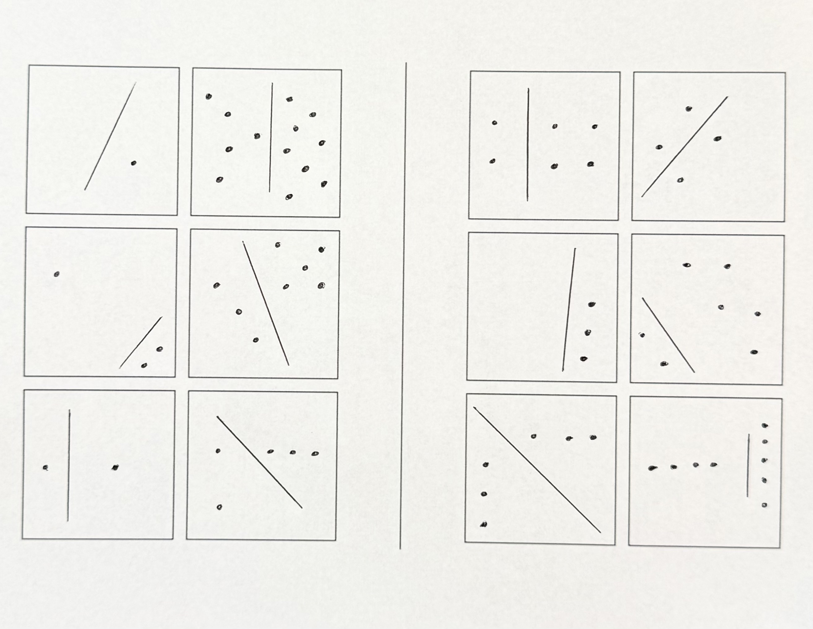

# Bongard Problems
Matt Hodges
2026-08-19

Bongard problems are interesting puzzles; they’re sort of like [Spot The
Difference](https://en.wikipedia.org/wiki/Spot_the_difference) meets
[Raven’s Progressive
Matrices](https://en.wikipedia.org/wiki/Raven%27s_Progressive_Matrices).
When presented with two sets of images, the challenge is to identify the
latent property that is shared by everything on the left but absent (or
different) from everything on the right.

Here’s a simple Bongard problem, created by [Mikhail Moiseevich
Bongard](https://www.foundalis.com/res/Mikhail_Moiseevich_Bongard.html):

, by Mikhail
Moiseevich Bongard](bongard-problem-10.png)

> [!NOTE]
>
> ### Reveal Solution
>
> **Solution:** Shapes on the left form approximately triangular
> outlines, while shapes on the right form approximately quadrilateral
> outlines.

And here’s a trickier Bongard problem, created by [Douglas
Hofstadter](https://en.wikipedia.org/wiki/Douglas_Hofstadter):

, by Douglas
Hofstadter](bongard-problem-155.png)

> [!NOTE]
>
> ### Reveal Solution
>
> **Solution:** On the left, curves are longer than straight lines,
> while on the right, curves are shorter than straight lines.

I first learned about Bongard problems while reading [Gödel, Escher,
Bach](https://en.wikipedia.org/wiki/G%C3%B6del,_Escher,_Bach), when
Hofstadter introduced them in his chapter *Artificial Intelligence:
Prospects*. [I’ve returned to Hofstadter’s puzzles
before](https://matthodges.com/posts/2025-04-21-openai-o4-mini-high-mu-puzzle/),
but Bongard problems are especially interesting because he used them to
imagine, in 1979, what a visual reasoning program might look like:

First, he imagined a **preprocessing** stage that detects salient
features that map to a mini-vocabulary of known concept terms like,
*line segment*, or *curve*, or *horizontal*. From there, preprocessing
applies its knowledge of elementary shapes to get to terms like,
*circle*, or *right angle*, or *vertex*. There’s a resemblance here to
what we now call [representation
learning](https://en.wikipedia.org/wiki/Representation_learning). In
[image classifiers built as convolutional
networks](https://matthodges.com/posts/2022-08-06-neural-network-from-scratch-python-numpy/),
the network learns internal representations useful for discriminating
images, though as distributed numerical representations rather than as
tidy vocabulary of named concepts. And
[CLIP](https://en.wikipedia.org/wiki/Contrastive_Language%E2%80%93Image_Pre-training)
is an especially interesting modern comparison because it learns image
and text representations in a shared space, allowing natural-language
descriptions to refer to learned visual concepts.

At this point in Hofstadter’s imaginary program, the picture is
“understood” at the basic level of mapping input images to labels. The
next stage is a search for **high-level descriptions** about the
features. The program “looks around” to spot descriptors like *to the
right of*, or *perpendicular to*, or *evenly spaced*. It can also build
**descriptions of descriptions**, looking for regularities across the
ways individual images have been described. There’s a resemblance here
to modern work on [relational
reasoning](https://deepmind.google/blog/a-neural-approach-to-relational-reasoning/),
where models try to represent not only the objects in an image but also
the relationships among them.

But simply generating more descriptions doesn’t solve a Bongard problem.
The program also has to decide where to **focus** and which kinds of
properties to **filter** for. A description can be perfectly true and
still be useless for distinguishing the two sides. The right abstraction
may only become visible after comparing several images, changing what
seems important, and returning to an earlier description with a
different idea of what to look for.

Hofstadter suggested various approaches and heuristics for making that
search less brittle. He imagined **templates and sameness-detectors**
that could trigger when several examples began to converge on the same
description. There’s a loose modern parallel in [some approaches to
meta-learning](https://en.wikipedia.org/wiki/Meta-learning_%28computer_science%29#Prototypical_Networks),
where models learn a space in which examples can be classified by their
distance from a common prototype. He also suggested a **semantic net**
in which *“all the known nouns, adjectives, etc., are linked in ways
which indicate their interrelations.”* That sounds a lot like [word
embeddings](https://en.wikipedia.org/wiki/Word_embedding).

Importantly, Hofstadter didn’t want early concepts or hypotheses to be
rigid. An idea that didn’t quite fit might be weakened, modified, or
allowed to **slip** toward a related concept rather than simply
discarded. A shape might be treated as a rough instance of something it
doesn’t satisfy exactly, or a group of objects might become a single
higher-level object once the problem suggests looking at it that way.
There’s a connection here to [analogical
reasoning](https://en.wikipedia.org/wiki/Analogy), where representations
of relationships need to be flexible enough to map across different
situations. More broadly, Hofstadter’s program depends on
representations remaining **tentative** enough that higher-level
hypotheses can change how the underlying images are described.

The chapter continues to dig into more layers of what this Bongard
problem-solving program might require, and how it maps to various forms
of recognition, grouping, filtering, and focusing. It’s not the only
place in GEB where Hofstadter’s ideas [map strangely well onto modern
AI](https://matthodges.com/posts/2025-08-26-music-to-break-models-by/),
but here he keeps circling two important assertions:

> These fascinating problems are intended for pattern-recognizers,
> whether human or machine.

and

> the skill of solving Bongard problems lies very close to the core of
> “pure” intelligence, if there is such a thing.

One of the most common dismissals of modern AI is that these systems are
“only” statistical pattern matchers, with pattern recognition placed on
one side of a line and genuine reasoning or intelligence on the other.
That distinction remains very much alive in [arguments over what today’s
“reasoning” models are actually
doing.](https://www.quantamagazine.org/is-ai-reasoning-right-for-the-wrong-reasons-20260731/)
But Hofstadter was describing pattern recognition while simultaneously
placing it near the core of intelligence.

Hofstadter was clear about what he meant by a “pattern-recognizer.” His
pattern-recognizer has to decide what in an image matters, describe
relationships among its parts, compare examples, discard true but
irrelevant observations, form tentative hypotheses, and sometimes revise
the concepts it is using when they don’t quite fit. Eventually it has to
find a pattern that isn’t contained in any one image, but exists across
the collection.

Taken this way, “pattern matching” doesn’t tell us very much about
whether a machine is intelligent. It describes a family of computations
whose limits depend on what kinds of patterns can be found, how abstract
those patterns can become, and whether they can be recognized in
situations unlike the ones that came before. By the time you assemble
everything his Bongard problem-solving program is supposed to do, it
becomes surprisingly difficult to say where pattern recognition ends and
reasoning begins. [Researchers are still using Bongard problems to probe
this boundary](https://arxiv.org/abs/2602.03038).

Today’s frontier models are not perfect at solving Bongard problems
(neither are humans), but they’re also capable of finding unintended
solutions.

I gave BP 155 (above) to GPT-5.6 Sol (High), and it quickly offered a
solution:

The rule is **right angles**.

- **Left:** none of the figures contains two straight line segments
  meeting at 90°.
- **Right:** every figure contains at least one right angle, usually an
  L-, T-, or rectangular corner.

The curls, loops, circles, and overall “curvy vs. angular” appearance
are mostly distraction. The first figure on the right is the sneakiest:
the little inward notch beneath the triangular part contains the right
angle.

This, of course, is not Hofstadter’s intended solution, but it appears
to be a valid solution nonetheless. One is global and quantitative, the
other local and categorical. The examples in the problem don’t
distinguish between them.

I also gave the problem to Claude Fable 5 (Max), and it produced two
incorrect answers:

Every left panel could be traced without ever producing a straight edge
or an angle, and every right panel contains at least one ruler-straight
stroke. The small circles attached to some of the right figures don’t
break the rule, since what separates the sides is whether the figure
contains any straight, angular strokes, and none of the left ones do.

There is a second regularity that happens to hold as well, in case it’s
the intended one for this particular puzzle: each right panel consists
of two separate pieces of ink (a main glyph plus a detached dot or
second mark), while each left figure is a single connected doodle, even
where its strokes cross themselves. The curved-versus-angular reading is
the more visually fundamental of the two, so that’s my answer.

Both of Fable’s answers are plainly false. There are clear angles among
the left set, and the left set contains counterexamples with
disconnected strokes. In Hofstadter’s terms, the error is at the
preprocessing stage; its descriptions of the images contain features
that simply aren’t there. His architecture invites top-down pressure on
those descriptions, since restructuring and slippage depend on it. But
that makes it important to keep checking revised descriptions against
the image itself, or a bad early description can turn into fabricated
evidence.

I expected both models to regurgitate a “known” answer from pretraining,
and it was interesting that neither did. But I still wanted a test I
could be certain hadn’t appeared in their training data, so I made a
brand new Bongard problem by hand:

Can you solve it?

GPT-5.6 Sol (High) spun for about three and a half minutes and found the
solution. Claude Fable 5 (Max) worked for about fifteen minutes and also
got it right.

> [!NOTE]
>
> ### Reveal Sol’s Solution
>
> 

>
> Got it. The line divides the dots into **two groups whose sizes are
> consecutive Fibonacci numbers**.
>
> The six left-hand examples are exactly the first six adjacent
> Fibonacci pairs, in scrambled order:
>
> - Top left: **0 + 1**
> - Bottom left: **1 + 1**
> - Middle left: **1 + 2**
> - Bottom right: **2 + 3**
> - Middle right: **3 + 5**
> - Top right: **5 + 8**
>
> So they walk through
>
> **0, 1, 1, 2, 3, 5, 8**
>
> with each box depicting one neighboring pair.
>
> The right-hand boxes deliberately give non-Fibonacci-adjacent
> partitions such as **2+4, 2+2, 0+3, 2+5, 3+3, 4+5**.
>
> That’s a lovely one because the line initially screams “geometry,” but
> its position only matters because it partitions the dots into two
> counts.
>
> 

> [!NOTE]
>
> ### Reveal Fable’s Solution
>
> 

>
> In each of the six left boxes, the line splits the dots into two
> consecutive Fibonacci numbers. Reading across the rows, the splits are
> 0\|1, 5\|8, 1\|2, 3\|5, 1\|1, and 2\|3, which makes the totals 1, 13,
> 3, 8, 2, and 5. So the left side contains exactly the Fibonacci
> numbers 1, 2, 3, 5, 8, 13, and each box is a little picture of the
> recurrence itself, with the two previous terms sitting on either side
> of the line and adding up to the total.
>
> The right boxes never do this. Their splits are 2\|4, 2\|2, 0\|3,
> 2\|5, 3\|3, and 4\|5, and none of those is a pair of neighboring
> Fibonacci numbers. Several are constructed as near misses, which is
> what makes the problem hard. The 2\|5 box uses two Fibonacci numbers
> that aren’t adjacent in the sequence, the 3\|3 box repeats a term
> instead of pairing neighbors, and the box with 3 dots has a Fibonacci
> total but puts all three on one side, so its split is 0\|3 rather than
> the 1\|2 it would need.
>
> 

Sol picked up that the lines suggest a geometric rule, but ultimately
that the relevant description is numerical. A solver has to count the
dots on either side, compare those counts across the examples, and
notice the relation shared by the left set. That looks a lot like the
process Hofstadter was describing. It has to generate possible
descriptions, decide which information matters, and revise the
representation until the distinction becomes visible.

Both models solved my new problem, but I don’t think that settles
whether Sol or Fable is reasoning. Nor do their earlier results rule it
out. Fable’s answer to BP155 builds a coherent argument on a visual
description that is simply false. Sol’s answer was unexpected, but may
not be an error at all. Neither outcome tells us that reasoning was
absent.

Still, “only a pattern matcher” starts to feel like a weak dismissal. In
my problem, recognizing the pattern required choosing what to attend to,
moving from geometry to number, comparing examples as a set, and finding
a relation in a problem the models had never seen. If all of that falls
under pattern matching, then the phrase leaves open much of what we care
about when we ask whether a system is intelligent.

If you want to try more Bongard problems yourself, Harry Foundalis
maintains a wonderful [Index of Bongard
problems](https://www.foundalis.com/res/bps/bpidx.htm), with hundreds
collected from Bongard, Hofstadter, Foundalis, and others. There’s also
the sprawling [On-Line Encyclopedia of Bongard
problems](https://oebp.org/).

Bongard problems are a fascinating way to investigate how much
abstraction and reasoning can fit inside what we call “pattern
recognition,” and how little agreement we have about where those
categories begin and end.
