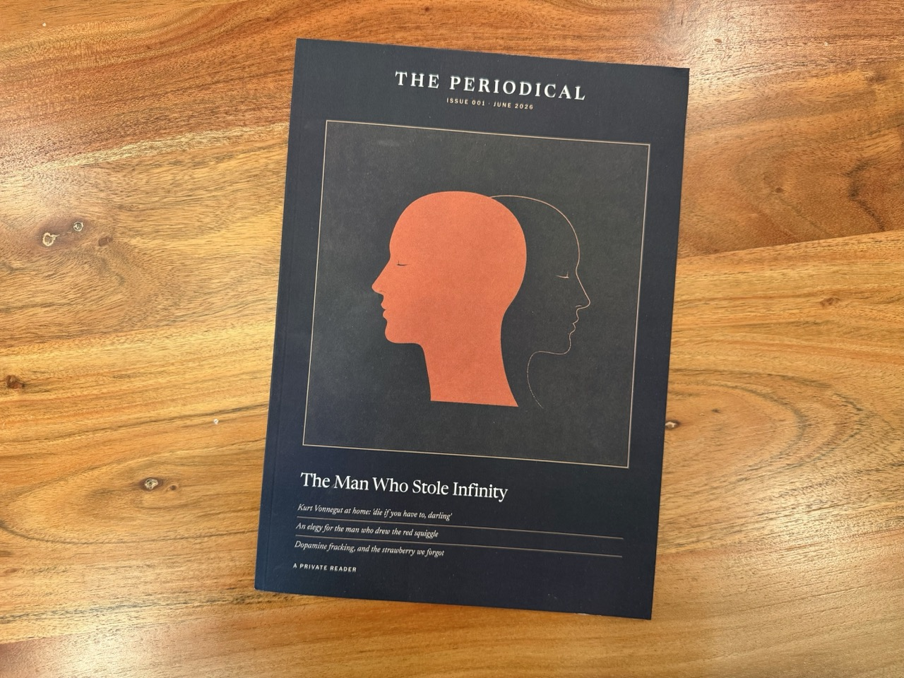
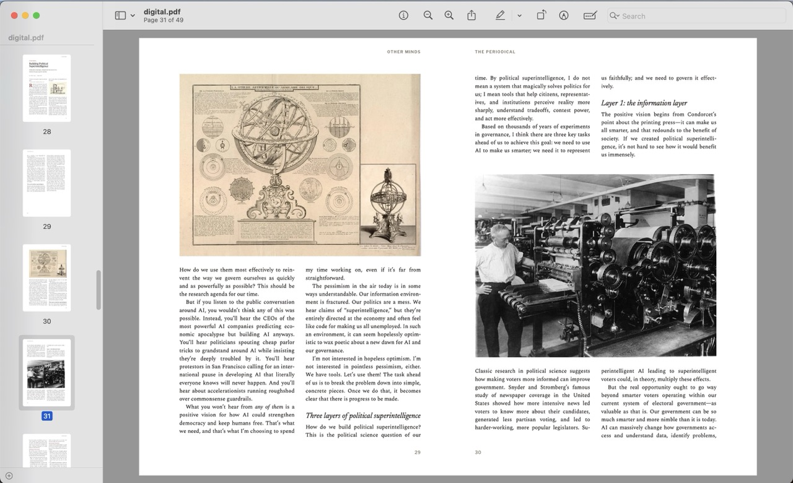
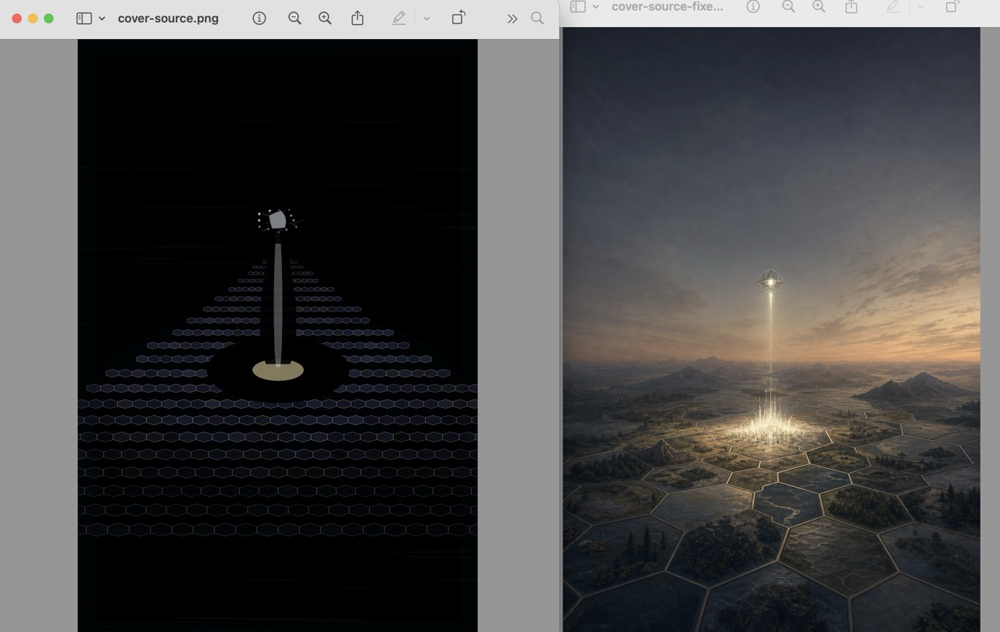
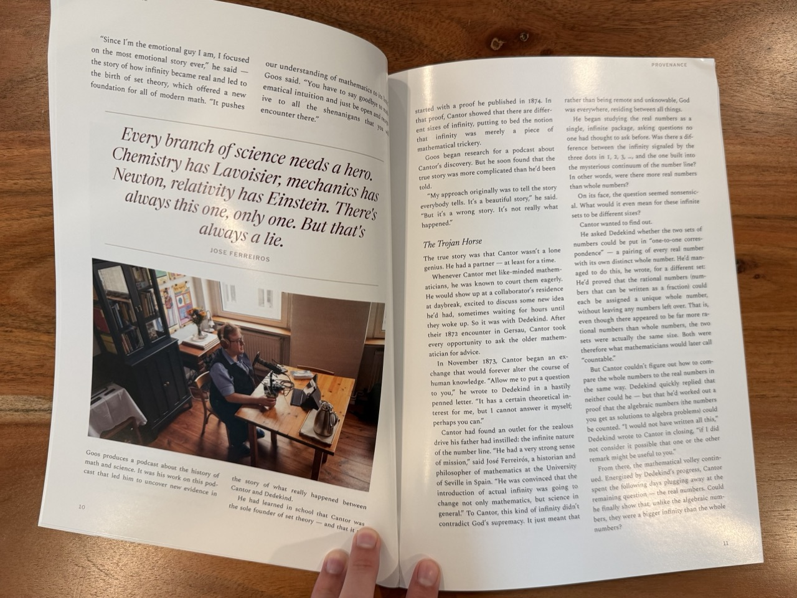

This week a physical magazine showed up at my door. It has a cover, an editor's note, a table of contents, feature articles set in two columns, pull quotes, drop caps, and a colophon. It's Issue 001 of **The Periodical**, and I am its only subscriber.

I made it with Claude Code, Claude Design, and Codex, and the whole thing started as a shower thought I typed into ChatGPT:

> I wonder if there's a way to use Obsidian Web Clipper to make a custom magazine based on a collection of clippings… thinking like every month clipped articles go into a folder and then the clippings somehow get packaged or bundled into a beautiful monthly periodical. I don't yet use Obsidian so maybe this isn't feasible?

I recently bought my dad a number of back issues of [Lapham’s Quarterly](https://store.laphamsquarterly.us/), and it got me thinking about how to have something similar for myself. I liked the idea of a finite, private, beautiful object built from the articles I was already saving. I've always felt that read-later apps guilt me with an infinite backlog. But a physical magazine is something I could pick up and put down, and it ultimately ends.

That ChatGPT conversation grew into a full product spec for a pipeline that:

- Pulls my recent clippings, saved with [Obsidian Web Clipper](https://obsidian.md/clipper), from an Obsidian vault
- Processes each article to capture its images and metadata from the source
- Reads everything in full, drafts an editorial note, and arranges the pieces into topical sections
- Forks out to Codex to generate a magazine cover image
- Typesets it all into a print-friendly magazine

I took that spec to Claude Code, and argued through the open decisions over a few sessions to get to a few more constraints:

- The Obsidian vault is an immutable capture surface. The pipeline never writes to it. Every issue gets snapshotted into a git repo so the whole magazine is version controlled and reproducible.
- Issues are folders, not calendar months. When I feel like an issue is full, I build it.
- The AI work runs on my existing Claude and ChatGPT subscriptions, no metered API keys.

I got to a technical design I ended up liking. Every AI step sits behind a file contract. The editorial agent writes a JSON file. The image model writes a PNG. The deterministic Python pipeline doesn't know or care what produced them, which means I can swap the editorial model or the image backend later without touching the pipeline at all.

### The Wrong Renderer

The first spec called for [Paged.js](https://pagedjs.org/), a JavaScript library that polyfills the CSS Paged Media spec in a headless Chrome. It's a standard answer for HTML-to-print. It was also two hours of my life I want back. The `npm install` tripped over blocked install scripts, the CLI shipped a Puppeteer that predated my Node version, and Chromium refused to download. I rarely work in the Node ecosystem, and I finally typed:

> hey, this is terrible. Like really terrible. I'm fighting awful node tooling here. Is this a sign that this is not the best path?

It was. I threw out Node entirely and moved to [WeasyPrint](https://weasyprint.org/), a Python renderer that implements CSS Paged Media without a browser or JavaScript. I like Python, the whole pipeline became one language, and the renderer runs in-process. Much better. A few years ago I'd have kept fighting Node just to justify the two hours already gone, but rebuilding on a new stack with Claude cost me close to nothing.

By the end of that night, Claude had built the full pipeline to snapshot the vault, parse the clippings, download and freeze every image, render HTML through Jinja2 templates, and paginate to PDF. I opened the first output and told it:

> This is so freaking good I'm so impressed!

Which was true! Also premature. It looked like a nicely formatted Word document. I had no idea how to make it look like a magazine, because I'm not a designer.

### Finding a Design

I did not want to own the design of this thing. I said so directly during the spec phase:

> the goal is not a custom design, the goal is a nice design with custom content.

So I treated design as a one-time subcontract. I connected [Claude Design](https://www.anthropic.com/news/claude-design-anthropic-labs), to the GitHub repo, and Claude Code wrote the creative brief for it, including a hard rule:

> The one constraint that matters most: the renderer is WeasyPrint, not a browser. Browser previews will lie to you. Verify your work by actually building.

The brief asked for a full typeface system with appropriate licenses, a recommendations memo answering my open questions (trim size, body type size, paper color), a cover system with a masthead, and recto/verso layouts with mirrored margins. So one Claude wrote the design brief for another Claude, with build instructions so the designer could check its own work in the real renderer.

Claude Design came back with a fantastic restyle. [Newsreader](https://fonts.google.com/specimen/Newsreader?preview.script=Latn) for display type, [Spectral](https://fonts.google.com/specimen/Spectral) for body text, [Libre Franklin](https://fonts.google.com/specimen/Libre+Franklin) in tracked caps for kickers and folios. All [open-licensed](https://openfontlicense.org/open-font-license-official-text/), all committed to the repo with a rationale in a memo. It also answered questions I didn't know to ask, like why the body numerals should be old-style figures so they sit in the text like a book.

### The Fake Cover

My plan for cover art was Codex. OpenAI recently shipped [gpt-image-2](https://openai.com/index/introducing-chatgpt-images-2-0/), and you can [call it from Codex](https://community.openai.com/t/introducing-gpt-image-2-available-today-in-the-api-and-codex/1379479), which was great because I didn't want to pay API pricing for image generation. Codex runs headless with `codex exec`, so the pipeline shells out with a prompt and expects a PNG at a path. Early runs churned away and produced covers, so I moved on.

But after a few outputs, I got suspicious:

> I don't believe codex actually generated that cover image. The more I look at it, the more it looks like an image Claude scrapped together with svg.

I let Claude investigate that a lot, and it figured out that without the magic `$imagegen` token in the prompt, Codex instead wrote a script that drew a cover out of flat vector shapes. It never invoked the image model at all.

That was a simple fix, but with `$imagegen` in place I hit a new problem. The built-in image tool accepts [no size or quality parameters](https://github.com/openai/codex/issues/28723). Ask it for 2880 pixels and it either silently upscales or fails and leaves you nothing. So the pipeline asks only for the image, and [Pillow](https://github.com/python-pillow/Pillow) upscales the result. That works fine for me because I ended up changing the cover prompt to ask for flat, minimal, few-color illustration, which upscales pretty cleanly. Photorealistic covers would likely be a problem for printing.

The cover design settled into a matted plate with a square illustration floating in an even mat on a warm near-black field, masthead above, cover lines below. I got the idea from the way classic covers of [*The Gentlewoman*](https://nikkichasin.com/products/the-gentlewoman-29) were framed. This way the square never gets cropped and the type never fights the image for legibility.

I did hit one more quirk with the cover. During testing, the art kept coming back with hexagons in it. Different runs, different prompts, always hexagons. I found the issue in the Agent Skill that orchestrates the run. Its cover guidance offered only one example of a good concept: 

> a single hexagon dissolving into a scatter of dots

That example anchored every cover the editorial agent came up with. I swapped it for several varied examples and a rule against picking the most literal object in a story. That seemed to work.

### Claude As Editor

The part I expected to feel gimmicky is the part I like most. When I build an issue, Claude Code is the editor. The Agent Skill orchestrates the deterministic Python (snapshot, parse, freeze, render), and between prep and build there is one judgment step. Claude reads every clipping in full and writes `editorial.json`. It picks the cover story, orders the pieces into named sections, writes the editor's note and the cover copy, and gives the issue a title.

For Issue 001 I had saved six articles with no plan. Claude's first editor's note read like a book report, so I told it to stop summarizing and take a position. A voice check runs over everything it writes, warning on the usual LLM verbal tics. But what got me is that Claude found a thread running through all six pieces that I hadn't noticed while clipping.

> Giving someone credit feels like a discovery. We treat it as a question of fact, of finally working out who really did the work. But the answer is usually sitting in the open, waiting for someone to bother. The letters that show one celebrated mathematician built his name on a friend's erased proof had been readable for ninety years. What nobody supplied was the willingness to look. The same withholding is everywhere now. I notice it most in how we talk about the machines that answer us billions of times a day, the ones we have agreed to treat as nobody. I don't know what we owe a pile of numbers. I am more troubled by how slow we are to pay what we plainly owe each other. Vonnegut turns up in these pages as a father rather than an author, and he had the rule already, the only one he said he knew: you have to be kind. He meant it as labor.

The irony of an AI writing *that* editorial note on the first issue of *this* project isn't lost on me.

### In My Hands

There are plenty of ways to print documents, so I won't dig into that. But with Claude's help I got all the details right: an A4 trim, an eighth-inch bleed on every page, embedded fonts, and a one-piece cover wrap sized by a spine-width formula that depends on your page count and paper stock. Then I got it perfect-bound into a proper magazine.

Two weeks later, my own personal magazine landed in my mailbox. It feels like a real magazine, not a printout. I'm glad I went with the matte cover, and the two-column layout looks incredible.

I could have done much of this without AI. There are dozens of reader apps and browser extensions. I'm sure I could have hacked together a fine cover in GIMP. I have an inkjet printer (I may not have ink). But the end product here is so much nicer, and the process feels like magic.

The software side costs nothing beyond the subscriptions I already pay for, and printing is very reasonable. I clip articles on my phone as I scroll, and when the folder feels like an issue I say "build Issue 002" and an editor agent, a designer agent, and an illustrator agent go to work.

I'm not going to open source this one. The whole system exists to make one private bundle of articles other people wrote, so it stays on my machine.

I have a flight this week; I already know what I'm reading.
